<div align="center">

# 🤖 AI System

### EXAONE 기반 RAG + AI Agent 플랫폼

[](/)
[](https://huggingface.co/LGAI-EXAONE)
[](/)
[](/)

LG AI Research의 **EXAONE 3.5 7.8B** 모델을 기반으로 한  
한국어 특화 RAG(검색 증강 생성) + AI Agent 시스템

</div>

---

## 🖼️ 주요 화면

<div align="center">
  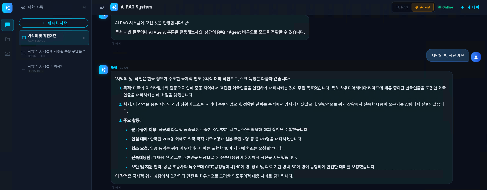
  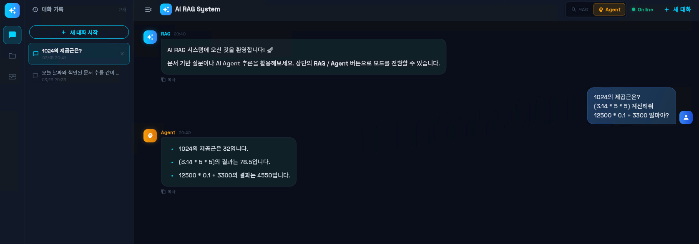
  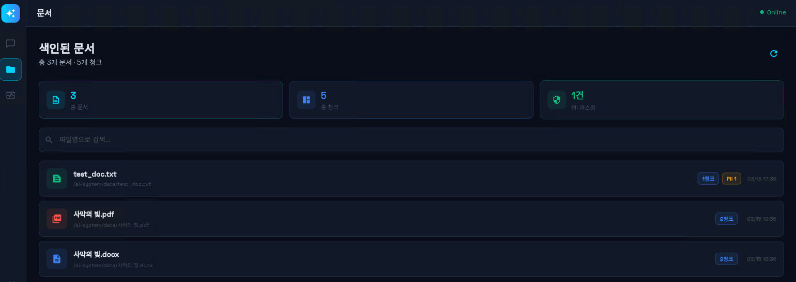
  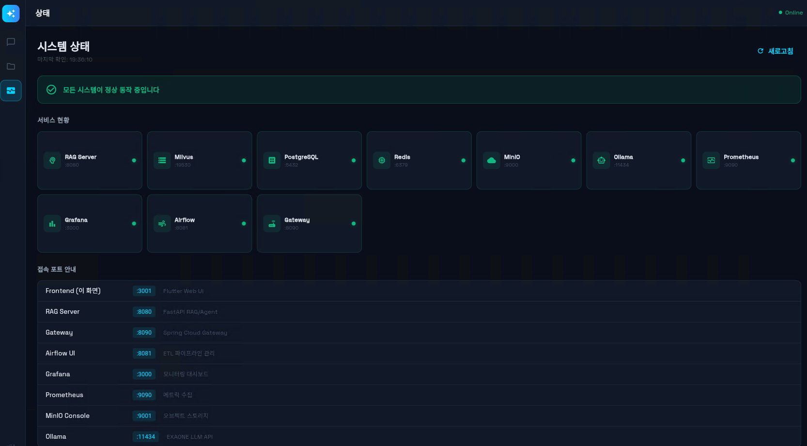
  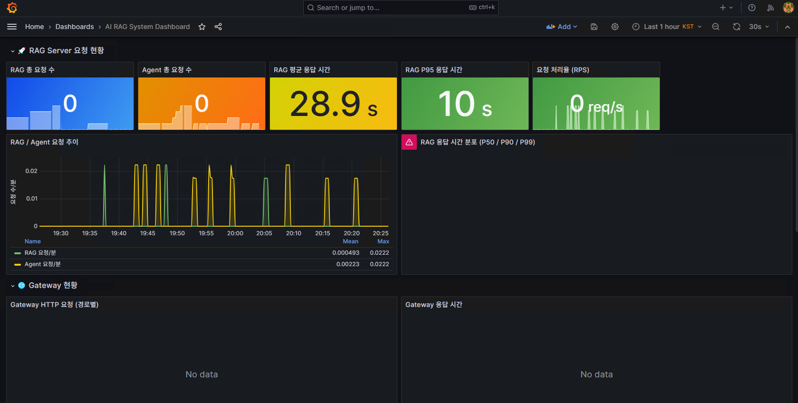
  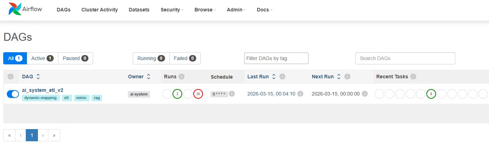
  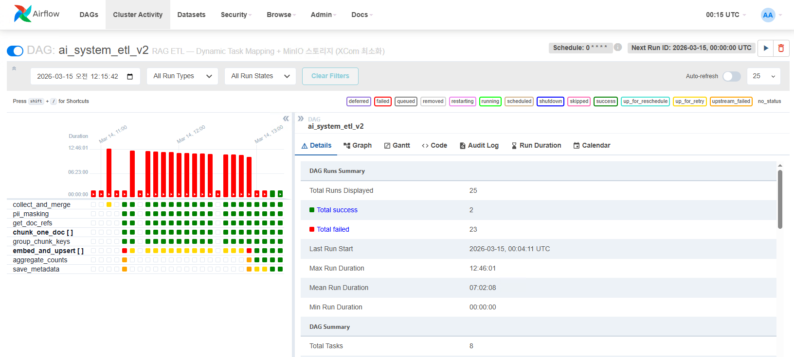
  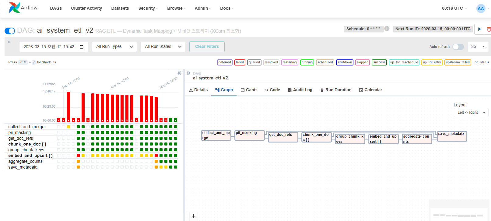
  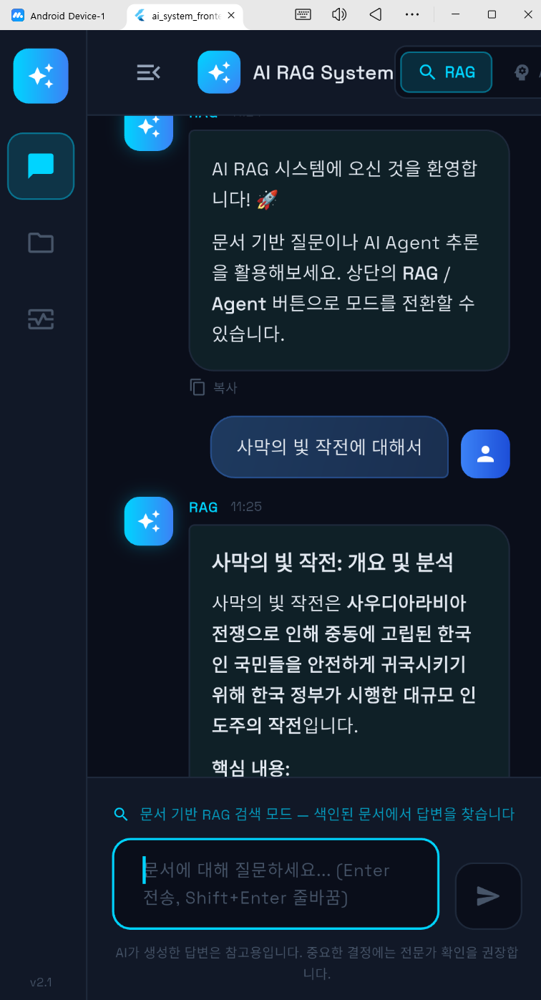
  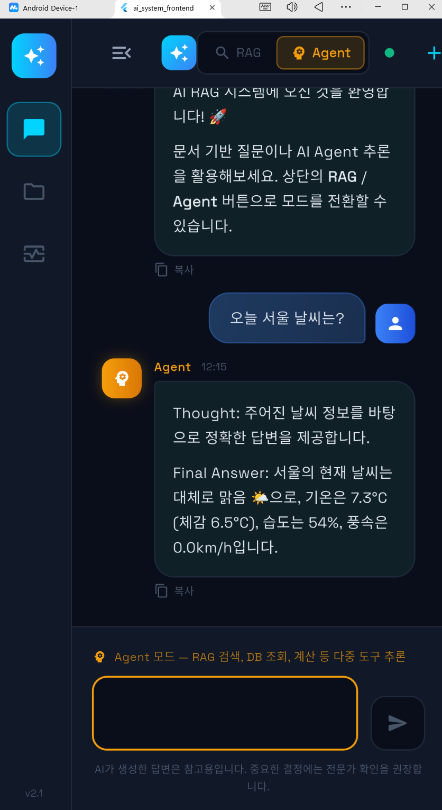  
</div>

## 📌 목차

- [시스템 개요](#-시스템-개요)
- [아키텍처](#-아키텍처)
- [주요 기능](#-주요-기능)
- [기술 스택](#-기술-스택)
- [빠른 시작](#-빠른-시작)
- [API 사용법](#-api-사용법)
- [환경 설정](#-환경-설정)
- [모니터링](#-모니터링)
- [프로젝트 구조](#-프로젝트-구조)
- [E2E 테스트](#-e2e-테스트)
- [알려진 이슈](#-알려진-이슈)

---

## 🌟 시스템 개요

VirtualBox + Vagrant 기반 로컬 VM 환경에서 동작하는 **온프레미스 AI 시스템**입니다.  
GPU 없이 CPU만으로 EXAONE 모델을 구동하며, 한국어 문서 검색과 AI 에이전트 기능을 제공합니다.

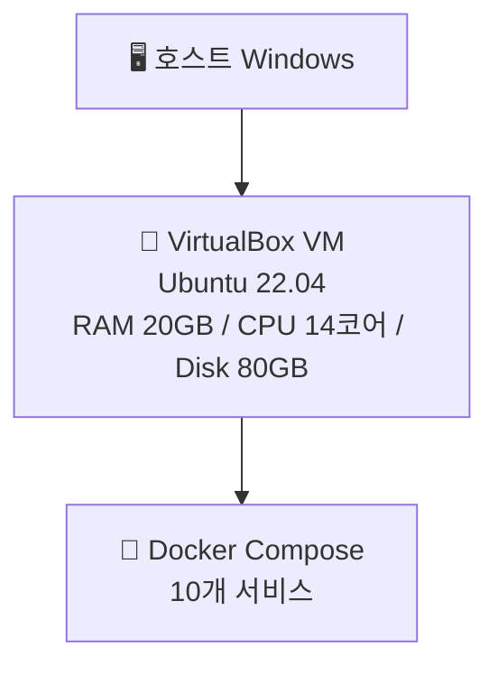

---

## 🏗 아키텍처

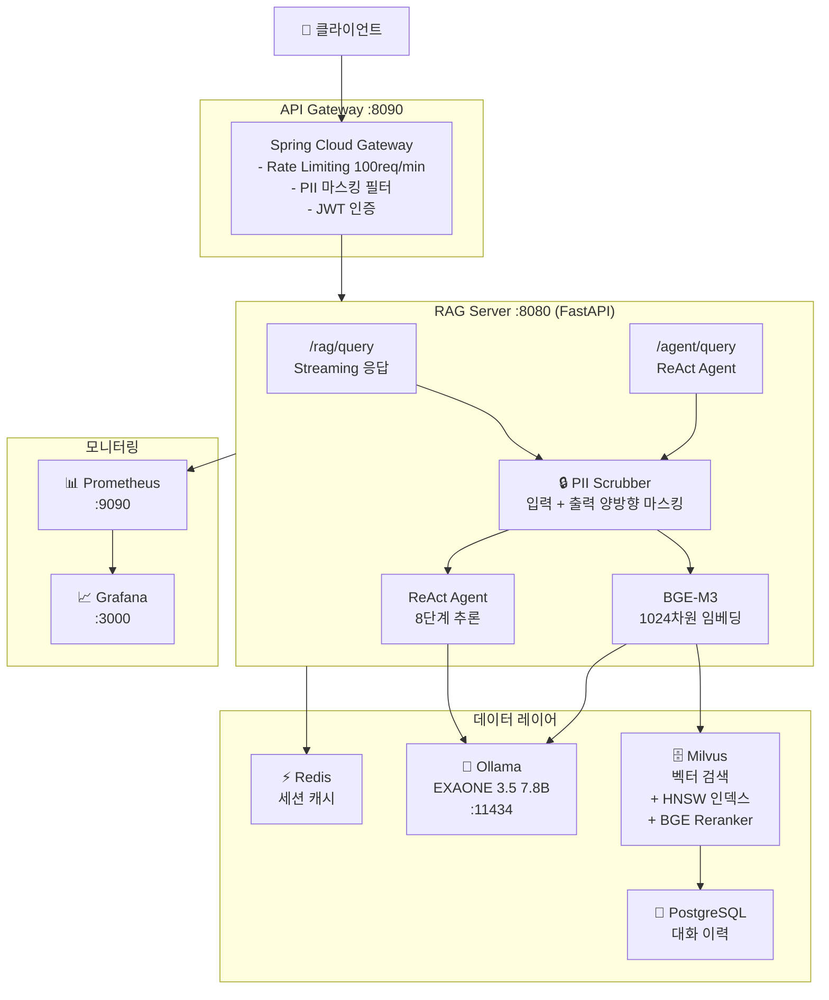

---

## 🔍 RAG 파이프라인


---

## 🤖 ReAct Agent 추론 흐름

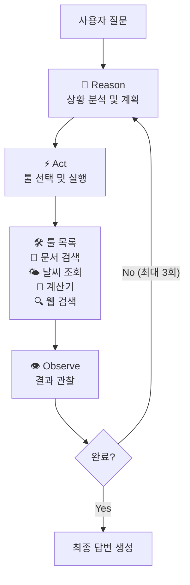

---

## 🏠 인프라 구조

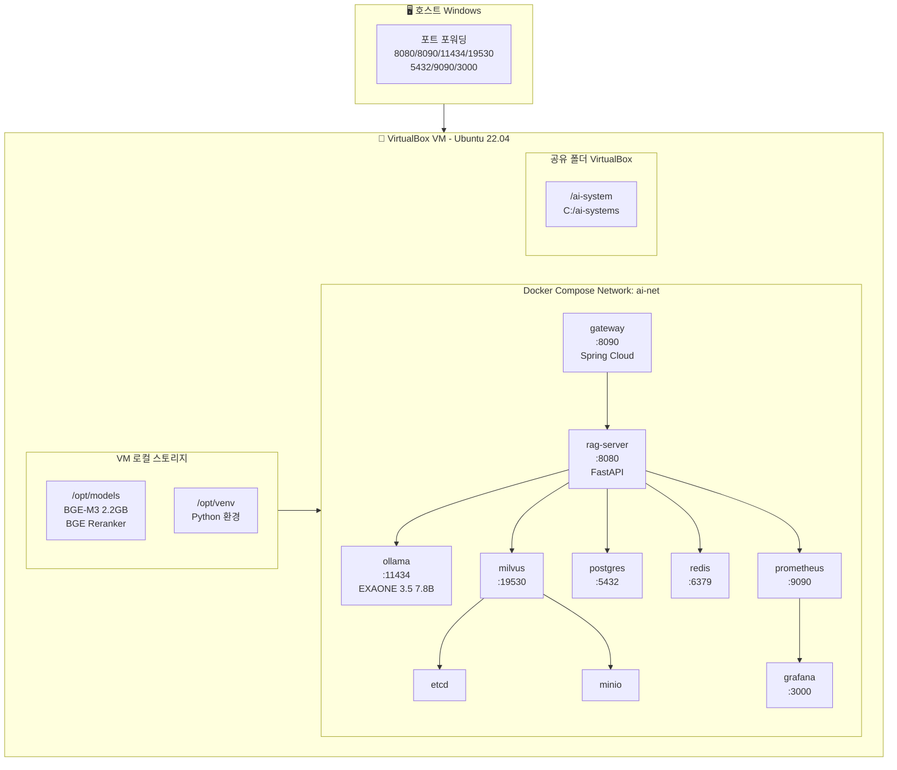

---

## ✨ 주요 기능

### 🔍 하이브리드 RAG 검색

- **BGE-M3** 임베딩 모델로 문서를 1024차원 벡터로 변환
- Milvus HNSW 인덱스로 고속 유사도 검색
- **BGE Reranker**로 검색 결과 정밀 재순위화
- 가상 문서 임베딩(HyDE) 기법으로 검색 품질 향상

### 🤖 ReAct AI Agent

- 3단계 추론 루프 (Reason → Act → Observe)
- 멀티툴 지원: 문서검색, 날씨, 계산기, 웹검색
- 대화 이력 기반 맥락 유지

### 🔒 PII 자동 마스킹

- **입력 + LLM 출력 양방향** 개인정보 마스킹
- 전화번호, 이메일, 주민번호 등 자동 탐지
- Presidio 기반 한국어 PII 처리

### 📊 실시간 모니터링

- Prometheus 메트릭 수집
- Grafana 대시보드 시각화
- 요청 수, 응답 시간, 오류율 추적

---

## 🛠 기술 스택

| 분류              | 기술                                    |
| --------------- | ------------------------------------- |
| **LLM**         | EXAONE 3.5 7.8B (LG AI Research)      |
| **임베딩**         | BGE-M3 (BAAI) — 1024차원, 100개 언어       |
| **재순위화**        | BGE Reranker v2-m3                    |
| **벡터DB**        | Milvus v2.4 + HNSW 인덱스                |
| **RAG 서버**      | FastAPI + Python 3.11                 |
| **API Gateway** | Spring Cloud Gateway (Java / Kotlin)  |
| **LLM 런타임**     | Ollama                                |
| **세션 캐시**       | Redis 7.2                             |
| **관계형 DB**      | PostgreSQL 16                         |
| **모니터링**        | Prometheus + Grafana                  |
| **인프라**         | Docker Compose + Vagrant + VirtualBox |

---

## 🚀 빠른 시작

### 사전 요구사항

- Windows 10/11 (호스트)
- VirtualBox 7.x
- Vagrant 2.x
- 호스트 RAM 32GB 이상 권장
- 호스트 디스크 여유 100GB 이상

### 1. 저장소 클론

```bash
git clone <repository-url>
cd ai-systems
```

### 2. VM 생성

```powershell
# PowerShell (관리자 권한)
cd C:\ai-systems
vagrant up
```

> 최초 실행 시 약 30~40분 소요 (이미지 다운로드 포함)

### 3. VM 디스크 확장 (필수)

```powershell
# VM 종료
vagrant halt

# 디스크 80GB로 확장
cd "C:\Program Files\Oracle\VirtualBox"
.\VBoxManage modifymedium disk "C:\Users\<user>\VirtualBox VMs\ai-system-vm\ubuntu-jammy-22.04-cloudimg.vmdk" --resize 81920

# VM 재시작
cd C:\ai-systems
vagrant up
vagrant ssh
```

```bash
# VM 안에서 파티션 확장
sudo growpart /dev/sda 1
sudo resize2fs /dev/sda1
df -h /   # 79G 확인
```

### 4. Docker 스택 시작

```bash
vagrant ssh
cd /ai-system
docker compose up -d
```

### 5. EXAONE 모델 다운로드 및 등록

```bash
# 모델 다운로드 (~4.8GB, 10~20분)
docker exec ai-system-ollama-1 ollama pull exaone3.5:7.8b

# exaone alias 생성
docker exec ai-system-ollama-1 sh -c \
  'echo "FROM exaone3.5:7.8b" > /tmp/Modelfile && ollama create exaone -f /tmp/Modelfile'
```

### 6. BGE-M3 모델 다운로드

```bash
source /opt/venv/bin/activate
python3 -c "
from sentence_transformers import SentenceTransformer
SentenceTransformer('BAAI/bge-m3', device='cpu', cache_folder='/ai-system/models/bge-m3')
print('완료')
"

# VM 로컬로 복사 (공유 폴더 I/O 성능 문제 해결)
sudo cp -r /ai-system/models/bge-m3/ /opt/models/
```

### 7. DB 초기화

```bash
# Milvus
python3 init_milvus.py

# PostgreSQL
docker exec -i ai-system-postgres-1 psql -U postgres -d ai_system < /ai-system/init_postgres.sql
```

### 8. E2E 테스트

```bash
bash test_e2e.sh
```

```
(venv) vagrant@ai-system:/ai-system$ bash test_e2e.sh
╔══════════════════════════════════════╗
║   AI System E2E Test Suite           ║
╚══════════════════════════════════════╝
━━━━ [1/6] Ollama 상태 확인 ━━━━
  ✅ PASS: Ollama API 응답
━━━━ [2/6] RAG 서버 헬스체크 ━━━━
  ✅ PASS: RAG Health 200
━━━━ [3/6] RAG 쿼리 테스트 ━━━━
  ✅ PASS: RAG 응답 존재
━━━━ [4/6] Agent 쿼리 테스트 ━━━━
  ✅ PASS: Agent answer 필드
━━━━ [5/6] PII 마스킹 확인 ━━━━
  ✅ PASS: PII 마스킹 — 원본 번호 미포함
━━━━ [6/6] 컨테이너 리소스 현황 ━━━━
ai-system-rag-server-1: 5.718GiB / 8GiB | CPU: 0.20%
ai-system-ollama-1: 5.679GiB / 7GiB | CPU: 0.00%
ai-system-gateway-1: 257.5MiB / 800MiB | CPU: 0.12%
ai-system-milvus-1: 144MiB / 4GiB | CPU: 7.20%
ai-system-postgres-1: 39.27MiB / 1GiB | CPU: 0.00%
ai-system-redis-1: 6.77MiB / 1GiB | CPU: 0.14%
ai-system-prometheus-1: 32.67MiB / 512MiB | CPU: 0.00%
ai-system-grafana-1: 65.74MiB / 512MiB | CPU: 0.05%
ai-system-minio-1: 105.6MiB / 1GiB | CPU: 0.09%
ai-system-etcd-1: 24.21MiB / 512MiB | CPU: 0.88%

╔══════════════════════════════════════╗
║  결과: PASS=5 / FAIL=0 / TOTAL=5     ║
║  🎉 모든 테스트 통과!                ║
╚══════════════════════════════════════╝
```

---

## 📡 API 사용법

### RAG 쿼리

```bash
curl -N -X POST http://localhost:8080/rag/query \
  -H "Content-Type: application/json" \
  -d '{
    "query": "EXAONE 모델의 특징은 무엇인가요?",
    "session_id": "user-001"
  }'
```

**응답** (Streaming):

```
EXAONE은 LG AI Research가 개발한 한국어 특화 대형 언어 모델로...
```

### Agent 쿼리

```bash
curl -X POST http://localhost:8080/agent/query \
  -H "Content-Type: application/json" \
  -d '{
    "query": "오늘 서울 날씨를 알려주고 관련 문서도 검색해줘",
    "session_id": "user-001"
  }'
```

**응답**:

```json
{
  "answer": "오늘 서울의 날씨는..."
}
```

### 헬스체크

```bash
curl http://localhost:8080/health
# {"status": "ok", "timestamp": 1234567890}
```

### Gateway를 통한 접근

```bash
# Gateway (포트 8090) 통해서도 동일하게 접근 가능
curl -N -X POST http://localhost:8090/rag/query \
  -H "Content-Type: application/json" \
  -d '{"query": "질문", "session_id": "user-001"}'
```

---

## ⚙️ 환경 설정

### 포트 목록

| 서비스        | 포트    | 설명         |
| ---------- | ----- | ---------- |
| Gateway    | 8090  | API 진입점    |
| RAG Server | 8080  | FastAPI 서버 |
| Ollama     | 11434 | LLM API    |
| Milvus     | 19530 | 벡터DB       |
| PostgreSQL | 5432  | 관계형 DB     |
| Redis      | 6379  | 세션 캐시      |
| Prometheus | 9090  | 메트릭        |
| Grafana    | 3000  | 대시보드       |

### 환경 변수 (docker-compose.yml)

```yaml
OLLAMA_URL: http://ollama:11434
MILVUS_HOST: milvus
REDIS_HOST: redis
REDIS_PASSWORD: changeme
PG_HOST: postgres
PG_PASSWORD: changeme
```

---

## 📈 모니터링

### Grafana 대시보드

- URL: http://localhost:3000
- ID/PW: `admin` / `admin`

### Prometheus 메트릭

- URL: http://localhost:9090
- RAG 요청 수: `rag_requests_total`
- Agent 요청 수: `agent_requests_total`
- 응답 시간: `rag_latency_seconds`

### 컨테이너 리소스 현황

```bash
docker stats --format "table {{.Name}}\t{{.CPUPerc}}\t{{.MemUsage}}"
```

---

## 📁 프로젝트 구조

```
ai-systems/
├── Vagrantfile                 # VM 설정
├── docker-compose.yml          # 전체 스택 구성
├── Modelfile                   # EXAONE Ollama 설정
├── init_milvus.py              # Milvus 초기화
├── init_postgres.sql           # PostgreSQL 초기화
├── test_e2e.sh                 # E2E 테스트
├── benchmark.sh                # 성능 벤치마크
│
├── rag_server/                 # FastAPI RAG 서버 (Python)
│   ├── main.py                 # 메인 서버 (RAG + Agent 엔드포인트)
│   ├── agent.py                # ReAct Agent 구현
│   ├── embedder.py             # BGE-M3 임베딩
│   ├── etl.py                  # 문서 ETL 파이프라인
│   ├── pii_scrubber.py         # PII 마스킹
│   ├── requirements.txt        # Python 의존성
│   └── Dockerfile
│
├── gateway/                    # API Gateway (Kotlin)
│   ├── src/
│   ├── build.gradle.kts
│   └── Dockerfile
│
├── gateway-java/               # API Gateway (Java+Maven)
│   ├── src/
│   ├── pom.xml
│   └── Dockerfile
│
├── rag-server-java/            # RAG Server (Java+Maven)
│   ├── src/
│   ├── pom.xml
│   └── Dockerfile
│
├── config/
│   └── prometheus.yml          # Prometheus 설정
│
└── docs/                       # 시스템 문서 (13개)
    ├── 00_index.md
    ├── 01_overview.md
    └── ...
```

---

## 🧪 E2E 테스트

```bash
bash test_e2e.sh
```

| 테스트                | 내용             | 상태  |
| ------------------ | -------------- | --- |
| [1/5] Ollama 상태 확인 | API 응답 확인      | ✅   |
| [2/5] RAG 헬스체크     | /health 200 응답 | ✅   |
| [3/5] RAG 쿼리       | 응답 존재 확인       | ✅   |
| [4/5] Agent 쿼리     | answer 필드 확인   | ✅   |
| [5/5] PII 마스킹      | 원본 번호 미포함 확인   | ✅   |

---

## ⚠️ 알려진 이슈 및 주의사항

| 항목                   | 내용                                                           |
| -------------------- | ------------------------------------------------------------ |
| **VirtualBox 공유 폴더** | symlink 미지원. venv는 `/opt/venv`, AI 모델은 `/opt/models` 에 저장 필수 |
| **VMDK 확장**          | 반드시 `vagrant halt` 후 진행. 실행 중 확장 시 GRUB 손상 위험                |
| **메모리 요구사항**         | BGE-M3 + Reranker 합계 ~3.5GB. `mem_limit: 8g` 필수              |
| **모델 로딩 시간**         | 서버 최초 시작 시 BGE-M3 로드에 3~5분 소요                                |
| **CPU 추론 속도**        | GPU 없는 환경에서 EXAONE 응답 생성에 1~3분 소요                            |
| **Ollama 모델명**       | `exaone3.5:7.8b` pull 후 반드시 `exaone` alias 생성 필요             |

---

## 📄 관련 문서

- [시스템 아키텍처](docs/01_overview.md)
- [RAG 파이프라인](docs/04_rag_pipeline.md)
- [Agent 설계](docs/05_agent.md)
- [ETL 파이프라인](docs/06_etl.md)
- [모니터링](docs/11_monitoring.md)
- [운영 가이드](docs/12_operations.md)
- [이슈 로그](Issue-2026-03-13.md)

---

## 👥 개발 환경

| 항목      | 사양                               |
| ------- | -------------------------------- |
| 호스트 OS  | Windows 10/11                    |
| CPU     | AMD Ryzen 7 4800H (8코어 16스레드)    |
| RAM     | 32GB                             |
| GPU     | NVIDIA GeForce GTX 1650 Ti (미사용) |
| VM RAM  | 20GB                             |
| VM CPU  | 14코어                             |
| VM Disk | 80GB                             |

---

<div align="center">

**Built with ❤️ using EXAONE by LG AI Research**

</div>
