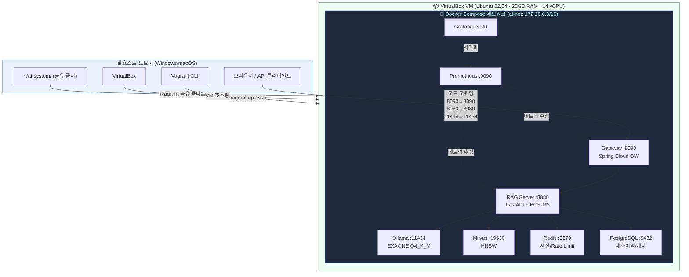
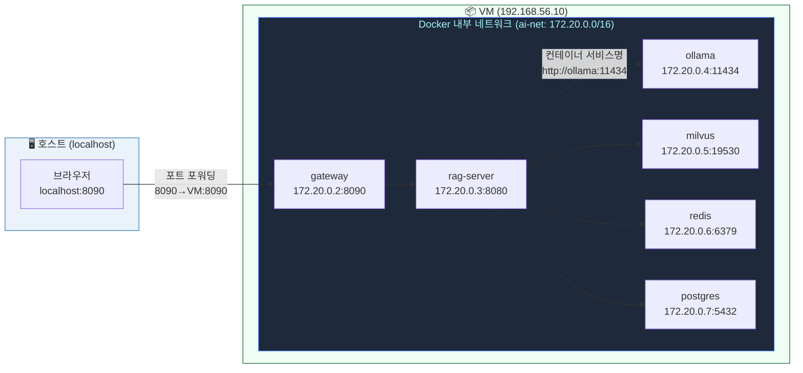
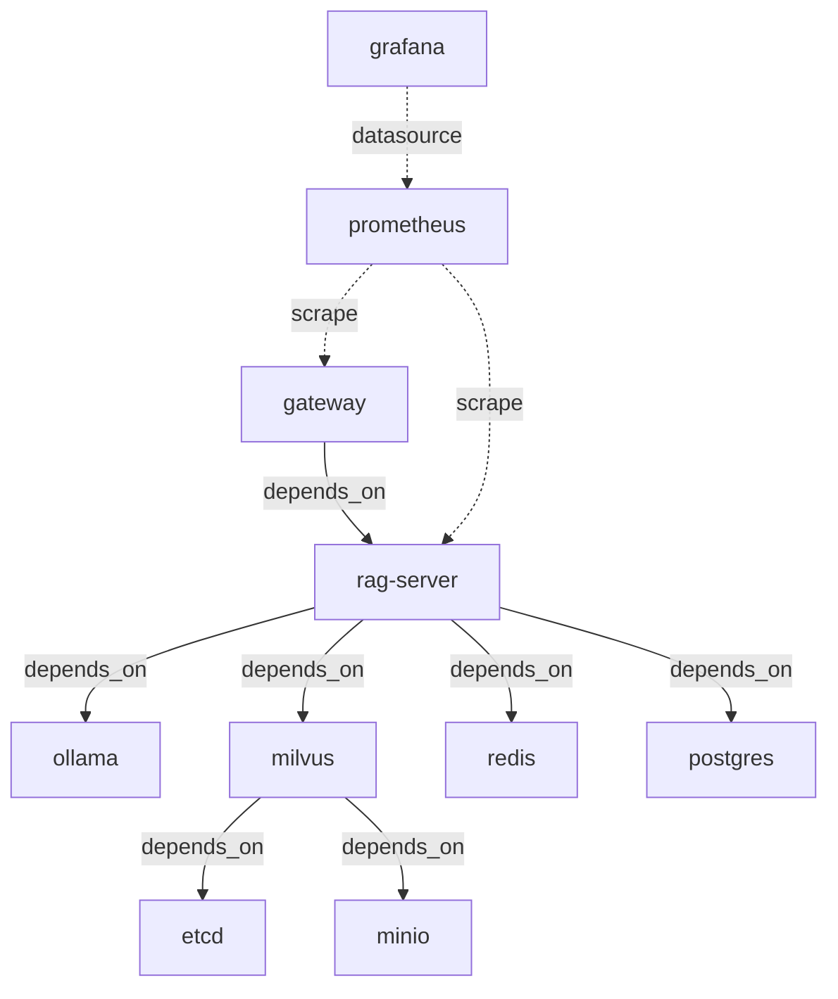

# 02. 시스템 아키텍처 (System Architecture)

> **버전**: v1.0 | **기준**: AI_System_Architecture.md v3.0

---

## 1. 전체 아키텍처 — 호스트 ↔ VM 관계



---

## 2. VM 내부 Docker 네트워크 구조



---

## 3. 서비스 컴포넌트 상세

### 3.1 컴포넌트 역할 매핑

| 컴포넌트 | 이미지 | 역할 | 메모리 제한 |
|---------|--------|------|------------|
| `ollama` | `ollama/ollama:latest` | EXAONE CPU 추론 엔진 | 7GB |
| `rag-server` | 자체 빌드 (Python 3.11) | RAG + Agent FastAPI | 4GB |
| `gateway` | 자체 빌드 (JDK 21) | JWT 인증 · Rate Limit · PII 필터 | 800MB |
| `milvus` | `milvusdb/milvus:v2.4.0` | 벡터 DB (HNSW) | 4GB |
| `etcd` | `quay.io/coreos/etcd:v3.5.5` | Milvus 메타데이터 저장소 | 512MB |
| `minio` | `minio/minio:2023-03-13` | Milvus 오브젝트 스토리지 | 1GB |
| `redis` | `redis:7.2-alpine` | 세션 캐시 · Rate Limit 카운터 | 1GB |
| `postgres` | `postgres:16-alpine` | 대화 이력 · 문서 메타 | 1GB |
| `prometheus` | `prom/prometheus:v2.50.1` | 메트릭 수집 | 512MB |
| `grafana` | `grafana/grafana:10.3.1` | 대시보드 | 512MB |

### 3.2 서비스 의존 관계



---

## 4. RAM 배분 계획

```
호스트 RAM 32GB
└── VirtualBox VM에 20GB 할당
    ├── Ollama (EXAONE Q4_K_M)     : 6.0 GB
    ├── BGE-M3 임베딩 (in-process)  : 2.0 GB
    ├── BGE-Reranker (in-process)   : 0.6 GB
    ├── Milvus Standalone           : 4.0 GB
    ├── MinIO + etcd                : 1.5 GB
    ├── Redis                       : 1.0 GB
    ├── PostgreSQL                  : 1.0 GB
    ├── RAG FastAPI 서버            : 1.0 GB
    ├── Spring Cloud Gateway        : 0.8 GB
    └── Ubuntu OS + Docker 오버헤드 : 2.1 GB
호스트 OS 잔여                      : 12 GB
```

---

## 5. 포트 포워딩 전체 목록

| 서비스 | VM 내부 포트 | 호스트 접근 포트 | 용도 |
|--------|-------------|----------------|------|
| Spring Cloud Gateway | 8090 | `localhost:8090` | 메인 API 진입점 |
| RAG FastAPI | 8080 | `localhost:8080` | 직접 디버그용 |
| Ollama | 11434 | `localhost:11434` | 모델 직접 테스트 |
| Milvus | 19530 | `localhost:19530` | 벡터 DB 직접 접근 |
| PostgreSQL | 5432 | `localhost:5432` | DB 클라이언트 연결 |
| Prometheus | 9090 | `localhost:9090` | 메트릭 확인 |
| Grafana | 3000 | `localhost:3000` | 대시보드 |

---

## 6. 원본 아키텍처 대비 변경 내역

| 항목 | 원본 (H100 × 2) | Vagrant VM 환경 | 이유 |
|------|----------------|----------------|------|
| 실행 환경 | 베어메탈 Linux 서버 | Vagrant + VirtualBox VM | 노트북 개발 환경 |
| 추론 엔진 | vLLM (GPU) | Ollama + llama.cpp (CPU) | GPU 없음 |
| 모델 포맷 | FP16 16GB VRAM | GGUF Q4_K_M ~5.5GB RAM | RAM 제한 |
| 임베딩 서버 | TEI 컨테이너 (GPU) | In-process CPU 모드 | 컨테이너 오버헤드 제거 |
| 오케스트레이션 | Kubernetes | Docker Compose | K8s는 자체가 4~8GB 소모 |
| 네트워킹 | 베어메탈 직접 노출 | 포트 포워딩 (host→VM) | VirtualBox NAT |
| 파일 공유 | 직접 경로 | Vagrant synced_folder | 호스트↔VM 파일 동기화 |
| 동시 사용자 | 80~120명 | 3~5명 | CPU 추론 속도 제약 |
