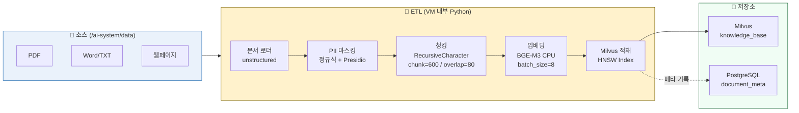

# 06. Vector ETL 파이프라인 (ETL Pipeline)

> **Phase 5** | PII 마스킹 → 청킹 → 임베딩 → Milvus 적재

---

## 1. ETL 데이터 흐름



---

## 2. STEP 12 — PII 마스킹 모듈

```python
# /ai-system/rag_server/pii_scrubber.py
import re

PII_PATTERNS = {
    "JUMIN":   r"\d{6}-[1-4]\d{6}",
    "PHONE":   r"01[016789]-\d{3,4}-\d{4}",
    "CARD":    r"\d{4}-\d{4}-\d{4}-\d{4}",
    "EMAIL":   r"[\w.-]+@[\w.-]+\.\w+",
    "ACCOUNT": r"\d{3}-\d{2}-\d{6}",
}

def scrub(text: str) -> tuple[str, dict]:
    """
    PII를 토큰으로 치환하고, 원본 → 토큰 매핑을 반환한다.
    
    Returns:
        (masked_text, token_map)
        예: ("[PHONE_1]", {"[PHONE_1]": "010-1234-5678"})
    """
    token_map = {}
    for label, pat in PII_PATTERNS.items():
        for i, m in enumerate(re.finditer(pat, text), 1):
            token = f"[{label}_{i}]"
            token_map[token] = m.group()
            text = text.replace(m.group(), token, 1)
    return text, token_map
```

### PII 패턴 상세

| 레이블 | 정규식 패턴 | 예시 |
|--------|-----------|------|
| JUMIN | `\d{6}-[1-4]\d{6}` | 900101-1234567 |
| PHONE | `01[016789]-\d{3,4}-\d{4}` | 010-1234-5678 |
| CARD | `\d{4}-\d{4}-\d{4}-\d{4}` | 1234-5678-9012-3456 |
| EMAIL | `[\w.-]+@[\w.-]+\.\w+` | user@example.com |
| ACCOUNT | `\d{3}-\d{2}-\d{6}` | 123-45-678901 |

---

## 3. STEP 13 — 임베딩 모듈 (CPU In-Process)

```python
# /ai-system/rag_server/embedder.py
from sentence_transformers import SentenceTransformer

_model = None

def get_model():
    global _model
    if _model is None:
        _model = SentenceTransformer("BAAI/bge-m3", device="cpu")
    return _model

def embed(texts: list[str]) -> list[list[float]]:
    """
    BGE-M3 CPU 모드로 임베딩 생성
    
    Args:
        texts: 임베딩할 텍스트 목록
    Returns:
        1024차원 float 벡터 목록 (L2 정규화됨)
    """
    return get_model().encode(
        texts,
        batch_size=8,
        normalize_embeddings=True,
        show_progress_bar=False,
    ).tolist()
```

> **BGE-M3 특징**: 다국어 지원, 1024차원, 한국어 검색 성능 우수

---

## 4. STEP 14 — ETL 파이프라인

```python
# /ai-system/rag_server/etl.py
from langchain.text_splitter import RecursiveCharacterTextSplitter
from pymilvus import Collection, connections
from pii_scrubber import scrub
from embedder import embed
import time

connections.connect("default", host="milvus", port="19530")

splitter = RecursiveCharacterTextSplitter(
    chunk_size=600,
    chunk_overlap=80,
    separators=["\n\n", "\n", "。", ". ", " "],
)

def ingest(raw_text: str, source: str, batch_size: int = 32):
    """
    원본 텍스트를 PII 마스킹 → 청킹 → 임베딩 → Milvus 적재
    
    Args:
        raw_text: 원본 문서 텍스트
        source: 문서 식별자 (경로 또는 URL)
        batch_size: 임베딩 배치 크기
    """
    clean, _ = scrub(raw_text)
    chunks   = splitter.split_text(clean)

    embeddings = []
    for i in range(0, len(chunks), batch_size):
        embeddings += embed(chunks[i : i + batch_size])

    col = Collection("knowledge_base")
    col.insert([
        chunks,
        [source]           * len(chunks),
        [int(time.time())] * len(chunks),
        embeddings,
    ])
    col.flush()
    print(f"✅ {len(chunks)} chunks ingested from '{source}'")
```

### 청킹 파라미터

| 파라미터 | 값 | 설명 |
|---------|-----|------|
| `chunk_size` | 600 | 청크 최대 문자 수 |
| `chunk_overlap` | 80 | 청크 간 겹침 문자 수 (문맥 연속성) |
| `separators` | `\n\n`, `\n`, `。`, `. `, ` ` | 우선순위 분할 기준 |

---

## 5. 성능 특성

| 항목 | 값 |
|------|-----|
| BGE-M3 CPU 임베딩 속도 | ~2~4 문서/분 |
| 권장 처리 방식 | 소규모: 즉시 처리 / 대량: 야간 배치 |
| batch_size 권장값 | 8 (CPU 메모리 2GB 기준) |

---

## 6. 사용 예시

```bash
# VM 내부에서 (Docker 컨테이너 내부이므로 milvus 서비스명 사용)
source /ai-system/.venv/bin/activate
cd /ai-system/rag_server

python3 - << 'EOF'
from etl import ingest

# 텍스트 직접 색인
ingest(
    raw_text="EXAONE은 LG AI Research가 개발한 한국어 특화 LLM입니다...",
    source="exaone_intro.txt"
)
EOF
```

```bash
# PDF 파일 색인 (unstructured 사용)
python3 - << 'EOF'
from unstructured.partition.pdf import partition_pdf
from etl import ingest
import os

pdf_path = "/ai-system/data/sample.pdf"
elements = partition_pdf(filename=pdf_path)
text = "\n".join([str(e) for e in elements])
ingest(text, source=os.path.basename(pdf_path))
EOF
```

---

## 7. ⚠️ 스키마 호환성 주의사항

### init_milvus.py vs Airflow ETL 스키마 차이

기존 `init_milvus.py`와 Airflow ETL DAG(`ai_system_etl_v2`)이 생성하는 Milvus 컬렉션 스키마가 다릅니다.

| 항목 | init_milvus.py (기존) | Airflow ETL (신규) |
|------|---------------------|-----------------|
| 벡터 필드명 | `embedding` | `vector` |
| 인덱스 타입 | HNSW | IVF_FLAT |
| 추가 필드 | `created_at` (INT64) | `content_hash`, `pii_count` |
| 스키마 필드 수 | 4개 (id 제외) | 5개 (id 제외) |

> **주의**: RAG Server `main.py`의 `vector_search()`는 `"embedding"` 필드명을 사용합니다.  
> Airflow ETL로 생성된 컬렉션(필드명: `vector`)을 사용하려면 `main.py`도 수정해야 합니다.

### 통합 스키마 (권장)

두 시스템을 모두 지원하는 통합 스키마를 사용하려면 컬렉션을 재생성하고 `main.py`를 수정하세요:

**1단계 — 통합 컬렉션 생성:**
```python
from pymilvus import connections, Collection, FieldSchema, CollectionSchema, DataType, utility

connections.connect(host="milvus", port=19530)

# 기존 컬렉션 삭제 후 재생성
if utility.has_collection("knowledge_base"):
    utility.drop_collection("knowledge_base")

fields = [
    FieldSchema("id",           DataType.INT64,        is_primary=True, auto_id=True),
    FieldSchema("content",      DataType.VARCHAR,       max_length=4096),
    FieldSchema("source",       DataType.VARCHAR,       max_length=512),
    FieldSchema("content_hash", DataType.VARCHAR,       max_length=64),
    FieldSchema("pii_count",    DataType.INT64),
    FieldSchema("vector",       DataType.FLOAT_VECTOR,  dim=1024),
]
schema = CollectionSchema(fields, description="RAG Knowledge Base v2")
col = Collection("knowledge_base", schema)

# IVF_FLAT 인덱스 (Airflow ETL 기준)
col.create_index("vector", {
    "index_type": "IVF_FLAT",
    "metric_type": "COSINE",
    "params": {"nlist": 128},
})
col.load()
print("통합 컬렉션 생성 완료")
```

**2단계 — main.py vector_search 수정:**
```python
# /ai-system/rag_server/main.py
def vector_search(query_emb: list, top_k: int = 15) -> list:
    col = Collection("knowledge_base")
    col.load()
    res = col.search(
        [query_emb], "vector",          # ← "embedding" → "vector" 변경
        {"metric_type": "COSINE", "params": {"ef": 64}},
        limit=top_k,
        output_fields=["content", "source"],
    )
    return res[0]
```

---

## 8. Airflow ETL 연동 (v2.1 이후)

v2.1부터 Apache Airflow 기반 자동화 ETL 파이프라인(`ai_system_etl_v2`)이 도입되었습니다.  
기존 수동 `etl.py` 방식은 유지되며, Airflow DAG이 추가된 방식입니다.

| 방식 | 파일 | 트리거 | 특징 |
|------|------|--------|------|
| 수동 ETL | `rag_server/etl.py` | 직접 실행 | 간단, 즉시 실행 |
| Airflow ETL | `airflow/dags/etl_dag_advanced_v2.py` | 매시간 자동 / 수동 | 자동화, 모니터링, 재시도 |

자세한 내용은 [13.airflow-ETL.md](./13.airflow-ETL.md) 참조.
