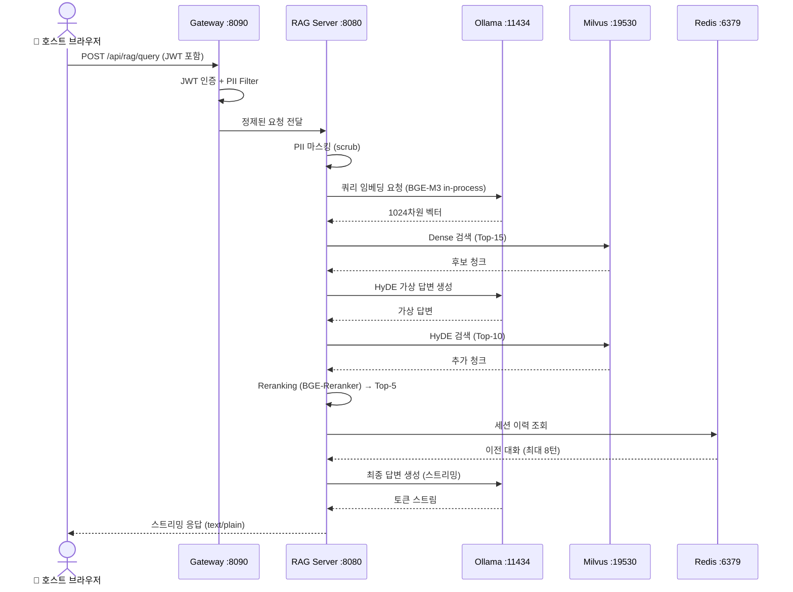
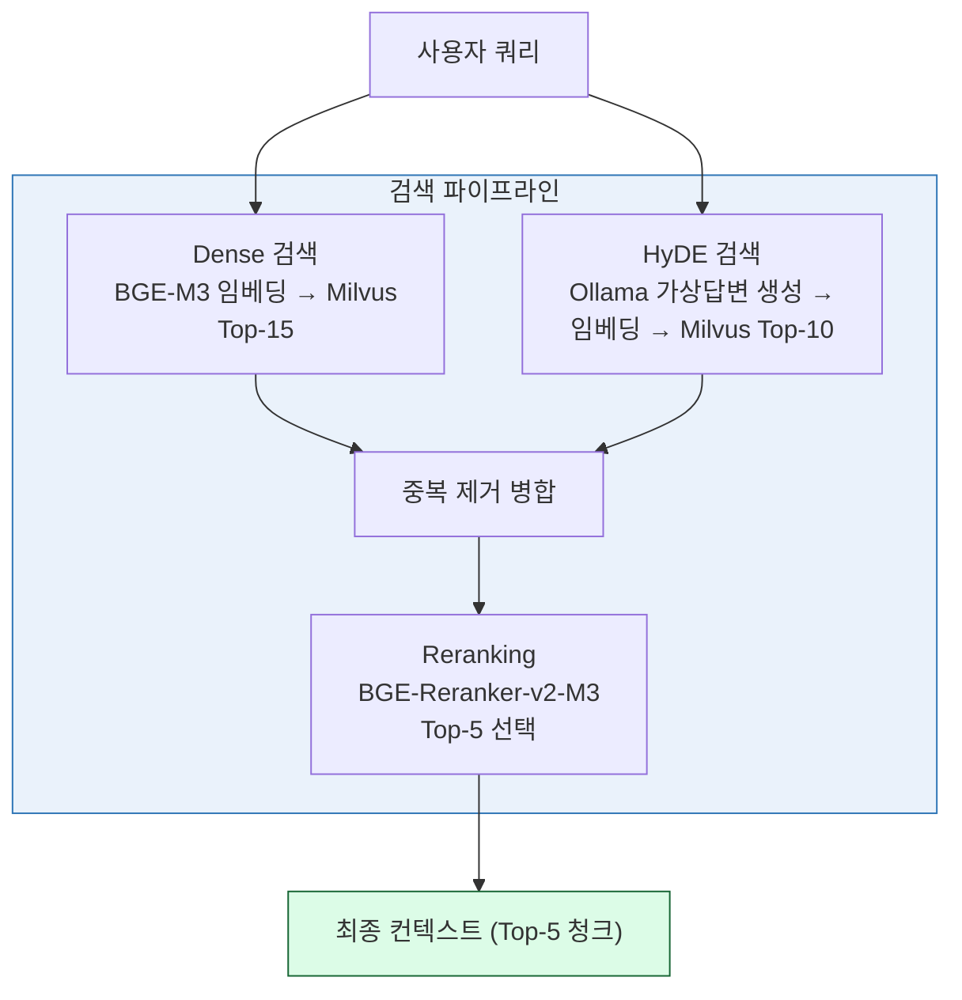

# 07. RAG 서버 구현 (RAG Server)

> **Phase 6** | FastAPI + HyDE + Reranker + 스트리밍 응답

---

## 1. RAG 요청 처리 흐름



---

## 2. 3단계 검색 전략



---

## 3. STEP 15 — RAG FastAPI 서버 (`main.py`)

```python
# /ai-system/rag_server/main.py
import os, json, redis, httpx, asyncio
from fastapi import FastAPI
from fastapi.responses import StreamingResponse
from pymilvus import Collection, connections
from sentence_transformers import CrossEncoder
from pii_scrubber import scrub
from embedder import embed

app = FastAPI()

OLLAMA_URL  = os.getenv("OLLAMA_URL",  "http://ollama:11434")
MILVUS_HOST = os.getenv("MILVUS_HOST", "milvus")
REDIS_HOST  = os.getenv("REDIS_HOST",  "redis")
REDIS_PASS  = os.getenv("REDIS_PASSWORD", "changeme")

connections.connect("default", host=MILVUS_HOST, port="19530")

reranker     = CrossEncoder("BAAI/bge-reranker-v2-m3", device="cpu")
redis_client = redis.Redis(host=REDIS_HOST, port=6379,
                            password=REDIS_PASS, decode_responses=True)

# ── 벡터 검색 ───────────────────────────────────────────────
def vector_search(query_emb: list, top_k: int = 15):
    col = Collection("knowledge_base")
    col.load()
    res = col.search(
        [query_emb], "embedding",
        {"metric_type": "COSINE", "params": {"ef": 64}},
        limit=top_k,
        output_fields=["content", "source"],
    )
    return res[0]

# ── HyDE 검색 ────────────────────────────────────────────────
def hyde_search(query: str, top_k: int = 10):
    resp = httpx.post(f"{OLLAMA_URL}/api/generate", json={
        "model":  "exaone",
        "prompt": f"다음 질문에 간략히 답하세요:\n{query}",
        "stream": False,
        "options": {"num_predict": 150, "temperature": 0.3},
    }, timeout=60)
    hyp_emb = embed([resp.json()["response"]])[0]
    return vector_search(hyp_emb, top_k)

# ── Reranking ────────────────────────────────────────────────
def rerank(query: str, hits: list, top_n: int = 5):
    texts  = [h.entity.content for h in hits]
    scores = reranker.predict([(query, t) for t in texts])
    ranked = sorted(zip(hits, scores), key=lambda x: x[1], reverse=True)
    return [h for h, _ in ranked[:top_n]]

# ── 세션 관리 ────────────────────────────────────────────────
def get_history(sid: str) -> list:
    data = redis_client.get(f"session:{sid}")
    return json.loads(data) if data else []

def save_history(sid: str, history: list):
    redis_client.setex(f"session:{sid}", 7200,
                       json.dumps(history, ensure_ascii=False))

# ── 메인 RAG 엔드포인트 ──────────────────────────────────────
@app.post("/rag/query")
async def rag_query(body: dict):
    query = body.get("query", "")
    sid   = body.get("session_id", "default")

    clean_q, _ = scrub(query)

    q_emb   = embed([clean_q])[0]
    dense_r = vector_search(q_emb,  top_k=15)
    hyde_r  = hyde_search(clean_q,  top_k=10)

    seen, candidates = set(), []
    for hit in dense_r + hyde_r:
        if hit.id not in seen:
            seen.add(hit.id)
            candidates.append(hit)
    top_chunks = rerank(clean_q, candidates, top_n=5)
    context    = "\n\n".join(h.entity.content for h in top_chunks)

    history  = get_history(sid)
    messages = [{"role": "system",
                 "content": f"참고 자료:\n{context}"}]
    messages.extend(history[-8:])
    messages.append({"role": "user", "content": clean_q})

    async def stream_gen():
        full = ""
        async with httpx.AsyncClient(timeout=120) as client:
            async with client.stream("POST", f"{OLLAMA_URL}/api/chat",
                json={"model": "exaone", "messages": messages,
                      "stream": True,
                      "options": {"num_predict": 1024}}) as r:
                async for line in r.aiter_lines():
                    if not line:
                        continue
                    chunk = json.loads(line)
                    token = chunk.get("message", {}).get("content", "")
                    full += token
                    yield token
                    if chunk.get("done"):
                        break
        history.append({"role": "user",      "content": clean_q})
        history.append({"role": "assistant",  "content": full})
        save_history(sid, history)

    return StreamingResponse(stream_gen(), media_type="text/plain")

@app.get("/health")
def health():
    return {"status": "ok"}
```

---

## 4. API 엔드포인트 명세

### POST `/rag/query`

**요청 본문**
```json
{
  "query": "EXAONE 모델에 대해 설명해주세요",
  "session_id": "user-session-001"
}
```

**응답**: `text/plain` 스트리밍

**처리 단계**:
1. PII 마스킹
2. BGE-M3 임베딩 (in-process)
3. Dense 검색 (Top-15)
4. HyDE 검색 (Top-10)
5. 중복 제거 후 Reranking (Top-5)
6. Redis 세션 이력 조회 (최대 8턴)
7. EXAONE 스트리밍 생성
8. 세션 이력 저장

### GET `/health`

**응답**
```json
{"status": "ok"}
```

---

## 5. Dockerfile

```dockerfile
# /ai-system/rag_server/Dockerfile
FROM python:3.11-slim
WORKDIR /app
COPY requirements.txt .
RUN pip install --no-cache-dir -r requirements.txt
COPY . .
CMD ["uvicorn", "main:app", "--host", "0.0.0.0", "--port", "8080", "--reload"]
```

---

## 6. requirements.txt

```text
fastapi
uvicorn[standard]
httpx
pymilvus
redis
sentence-transformers
langchain
langchain-community
presidio-analyzer
presidio-anonymizer
unstructured[pdf]
psycopg2-binary
```

---

## 7. 세션 관리 정책

| 항목 | 값 |
|------|-----|
| 세션 TTL | 2시간 (7200초) |
| 최대 대화 이력 | 8턴 (16 메시지) |
| 저장소 | Redis (key: `session:{session_id}`) |
| 직렬화 | JSON (ensure_ascii=False) |
