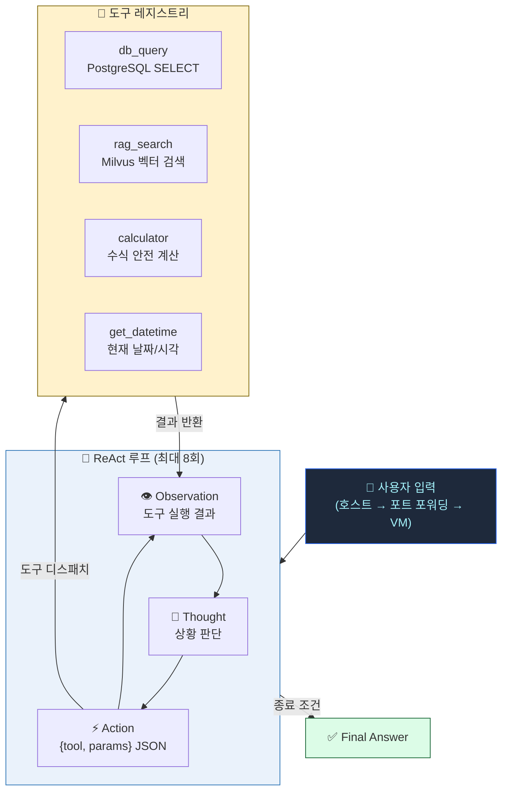

# 08. AI Agent (Tool Calling & ReAct)

> **Phase 7** | ReAct 루프 기반 멀티툴 AI Agent

---

## 1. ReAct Agent 실행 흐름



---

## 2. 도구 명세

| 도구명 | 설명 | 입력 파라미터 | 제약사항 |
|--------|------|------------|---------|
| `db_query` | PostgreSQL SELECT 쿼리 실행 | `sql`: SELECT 문 | SELECT만 허용 (DML 차단) |
| `rag_search` | 내부 지식베이스 벡터 검색 | `query`: 검색 질문 | 최대 500자 반환 |
| `calculator` | 수식 계산 | `expression`: 수식 | 숫자/연산자만 허용 |
| `get_datetime` | 현재 날짜와 시각 반환 | 없음 | - |

---

## 3. STEP 16 — ReAct Agent 구현 (`agent.py`)

```python
# /ai-system/rag_server/agent.py
import json, httpx, psycopg2, os
from datetime import datetime

OLLAMA_URL = os.getenv("OLLAMA_URL", "http://ollama:11434")
PG_HOST    = os.getenv("PG_HOST",    "postgres")
PG_PASS    = os.getenv("PG_PASSWORD","changeme")

TOOLS = {
    "db_query":    {"description": "PostgreSQL SELECT 쿼리 실행",
                    "params": {"sql": "SELECT 쿼리"}},
    "rag_search":  {"description": "내부 지식베이스 벡터 검색",
                    "params": {"query": "검색 질문"}},
    "calculator":  {"description": "수식 계산",
                    "params": {"expression": "예: 12.5 / 11.2 * 100"}},
    "get_datetime":{"description": "현재 날짜와 시각 반환",
                    "params": {}},
}

def execute_tool(name: str, params: dict) -> str:
    if name == "db_query":
        sql = params.get("sql", "")
        if not sql.strip().upper().startswith("SELECT"):
            return "Error: SELECT 쿼리만 허용됩니다."
        conn = psycopg2.connect(host=PG_HOST, database="ai_system",
                                user="postgres", password=PG_PASS)
        cur  = conn.cursor()
        cur.execute(sql)
        rows = cur.fetchmany(20)
        conn.close()
        return json.dumps(rows, ensure_ascii=False, default=str)

    elif name == "rag_search":
        resp = httpx.post("http://rag-server:8080/rag/query",
                          json={"query": params["query"],
                                "session_id": "agent"}, timeout=60)
        return resp.text[:500]

    elif name == "calculator":
        expr = params.get("expression", "")
        allowed = set("0123456789+-*/.() ")
        if all(c in allowed for c in expr):
            return str(eval(expr))
        return "Error: 허용되지 않는 문자"

    elif name == "get_datetime":
        return datetime.now().strftime("%Y년 %m월 %d일 %H시 %M분")

    return f"Error: 알 수 없는 도구 '{name}'"

SYSTEM_PROMPT = f"""도움이 되는 AI 어시스턴트입니다.
사용 가능한 도구:
{json.dumps(TOOLS, ensure_ascii=False, indent=2)}

반드시 아래 형식으로 응답하세요:
Thought: (한 줄 판단)
Action: {{"tool": "도구명", "params": {{...}}}}
Observation: (도구 결과)
... 반복 (최대 8회)
Final Answer: (최종 답변)
"""

def run_agent(user_query: str, max_steps: int = 8) -> str:
    messages = [{"role": "system", "content": SYSTEM_PROMPT},
                {"role": "user",   "content": user_query}]

    for _ in range(max_steps):
        resp = httpx.post(f"{OLLAMA_URL}/api/chat", json={
            "model":    "exaone",
            "messages": messages,
            "stream":   False,
            "options":  {"num_predict": 512, "temperature": 0.1},
        }, timeout=120)
        output = resp.json()["message"]["content"]

        if "Final Answer:" in output:
            return output.split("Final Answer:")[-1].strip()

        if "Action:" in output:
            try:
                action_str = output.split("Action:")[-1].split("Observation:")[0].strip()
                action     = json.loads(action_str)
                result     = execute_tool(action["tool"], action.get("params", {}))
                messages.append({"role": "assistant", "content": output})
                messages.append({"role": "user",
                                  "content": f"Observation: {result}"})
            except Exception as e:
                messages.append({"role": "user",
                                  "content": f"Observation: Error - {e}"})
        else:
            messages.append({"role": "assistant", "content": output})

    return "최대 추론 단계를 초과했습니다."
```

---

## 4. Agent 엔드포인트 추가 (`main.py`)

```python
# main.py 하단에 추가
from agent import run_agent

@app.post("/agent/query")
def agent_query(body: dict):
    return {"answer": run_agent(body.get("query", ""))}
```

---

## 5. API 엔드포인트 명세

### POST `/agent/query`

**요청 본문**
```json
{
  "query": "오늘 날짜와 2의 제곱근을 알려주세요"
}
```

**응답**
```json
{
  "answer": "오늘은 2026년 03월 13일이며, 2의 제곱근은 약 1.4142입니다."
}
```

---

## 6. ReAct 실행 예시

```
User: 오늘 날짜와 2의 제곱근을 알려주세요

Thought: 현재 날짜를 알아야 하므로 get_datetime 도구를 사용합니다.
Action: {"tool": "get_datetime", "params": {}}
Observation: 2026년 03월 13일 14시 30분

Thought: 2의 제곱근 계산이 필요합니다.
Action: {"tool": "calculator", "params": {"expression": "2 ** 0.5"}}
Observation: 1.4142135623730951

Final Answer: 오늘은 2026년 03월 13일 14시 30분이며, 2의 제곱근은 약 1.4142입니다.
```

---

## 7. 보안 고려사항

| 항목 | 구현 방식 |
|------|---------|
| SQL 인젝션 방어 | SELECT 키워드 시작 강제 확인 |
| 코드 인젝션 방어 | calculator: 허용 문자셋 화이트리스트 |
| 결과 크기 제한 | db_query: `fetchmany(20)` / rag_search: 500자 truncate |
| 최대 루프 제한 | `max_steps=8` 초과 시 강제 종료 |
