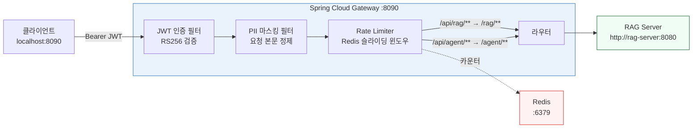

# 09. API Gateway (Spring Cloud Gateway)

> **Phase 8** | JWT 인증 · Rate Limiting · PII 필터 · 라우팅

---

## 1. Gateway 아키텍처



---

## 2. 프로젝트 구조

```
/ai-system/gateway/
├── Dockerfile
├── build.gradle.kts
└── src/main/
    ├── kotlin/com/ai/gateway/
    │   ├── GatewayApplication.kt
    │   ├── SecurityConfig.kt
    │   ├── RateLimiterConfig.kt
    │   └── PiiMaskingFilter.kt
    └── resources/
        └── application.yml
```

---

## 3. STEP 17 — application.yml

```yaml
# /ai-system/gateway/src/main/resources/application.yml
server:
  port: 8090

spring:
  cloud:
    gateway:
      routes:
        - id: rag-query
          uri: http://rag-server:8080
          predicates:
            - Path=/api/rag/**
          filters:
            - StripPrefix=1
            - name: RequestRateLimiter
              args:
                redis-rate-limiter.replenishRate: 10
                redis-rate-limiter.burstCapacity: 20
                key-resolver: "#{@userKeyResolver}"
            - name: PiiMaskingFilter

        - id: agent-query
          uri: http://rag-server:8080
          predicates:
            - Path=/api/agent/**
          filters:
            - StripPrefix=1
            - name: RequestRateLimiter
              args:
                redis-rate-limiter.replenishRate: 5
                redis-rate-limiter.burstCapacity: 10
                key-resolver: "#{@userKeyResolver}"

  security:
    oauth2:
      resourceserver:
        jwt:
          jwk-set-uri: http://keycloak:8080/realms/ai/protocol/openid-connect/certs

  data:
    redis:
      host: ${SPRING_REDIS_HOST:redis}
      port: 6379
      password: ${SPRING_REDIS_PASSWORD:changeme}

management:
  endpoints:
    web:
      exposure:
        include: health,prometheus
  metrics:
    export:
      prometheus:
        enabled: true
```

---

## 4. GatewayApplication.kt

```kotlin
// /ai-system/gateway/src/main/kotlin/com/ai/gateway/GatewayApplication.kt
package com.ai.gateway

import org.springframework.boot.autoconfigure.SpringBootApplication
import org.springframework.boot.runApplication

@SpringBootApplication
class GatewayApplication

fun main(args: Array<String>) {
    runApplication<GatewayApplication>(*args)
}
```

---

## 5. SecurityConfig.kt

```kotlin
// /ai-system/gateway/src/main/kotlin/com/ai/gateway/SecurityConfig.kt
package com.ai.gateway

import org.springframework.context.annotation.Bean
import org.springframework.context.annotation.Configuration
import org.springframework.security.config.annotation.web.reactive.EnableWebFluxSecurity
import org.springframework.security.config.web.server.ServerHttpSecurity
import org.springframework.security.web.server.SecurityWebFilterChain

@Configuration
@EnableWebFluxSecurity
class SecurityConfig {

    @Bean
    fun springSecurityFilterChain(http: ServerHttpSecurity): SecurityWebFilterChain {
        return http
            .csrf { it.disable() }
            .authorizeExchange { exchanges ->
                exchanges
                    .pathMatchers("/actuator/health").permitAll()
                    .anyExchange().authenticated()
            }
            .oauth2ResourceServer { oauth2 ->
                oauth2.jwt { }
            }
            .build()
    }
}
```

---

## 6. RateLimiterConfig.kt

```kotlin
// /ai-system/gateway/src/main/kotlin/com/ai/gateway/RateLimiterConfig.kt
package com.ai.gateway

import org.springframework.cloud.gateway.filter.ratelimit.KeyResolver
import org.springframework.context.annotation.Bean
import org.springframework.context.annotation.Configuration
import reactor.core.publisher.Mono

@Configuration
class RateLimiterConfig {

    @Bean
    fun userKeyResolver(): KeyResolver = KeyResolver { exchange ->
        val jwt = exchange.request.headers.getFirst("Authorization")
            ?.removePrefix("Bearer ")
            ?: "anonymous"
        // JWT sub claim 또는 IP 기반 키
        Mono.just(jwt.takeLast(16).ifEmpty { "anonymous" })
    }
}
```

---

## 7. PiiMaskingFilter.kt

```kotlin
// /ai-system/gateway/src/main/kotlin/com/ai/gateway/PiiMaskingFilter.kt
package com.ai.gateway

import org.springframework.cloud.gateway.filter.GatewayFilter
import org.springframework.cloud.gateway.filter.factory.AbstractGatewayFilterFactory
import org.springframework.core.io.buffer.DataBufferUtils
import org.springframework.http.server.reactive.ServerHttpRequestDecorator
import org.springframework.stereotype.Component
import reactor.core.publisher.Flux
import java.nio.charset.StandardCharsets

@Component
class PiiMaskingFilter : AbstractGatewayFilterFactory<PiiMaskingFilter.Config>(Config::class.java) {

    class Config

    private val patterns = listOf(
        Regex("""\d{6}-[1-4]\d{6}""")         to "[JUMIN]",
        Regex("""01[016789]-\d{3,4}-\d{4}""") to "[PHONE]",
        Regex("""\d{4}-\d{4}-\d{4}-\d{4}""") to "[CARD]",
        Regex("""[\w.-]+@[\w.-]+\.\w+""")     to "[EMAIL]",
    )

    override fun apply(config: Config): GatewayFilter = GatewayFilter { exchange, chain ->
        val request = exchange.request
        DataBufferUtils.join(request.body).flatMap { dataBuffer ->
            val bytes  = ByteArray(dataBuffer.readableByteCount())
            dataBuffer.read(bytes)
            DataBufferUtils.release(dataBuffer)
            var body = String(bytes, StandardCharsets.UTF_8)
            patterns.forEach { (regex, replacement) ->
                body = regex.replace(body, replacement)
            }
            val maskedBytes   = body.toByteArray(StandardCharsets.UTF_8)
            val bufferFactory = exchange.response.bufferFactory()
            val maskedBuffer  = bufferFactory.wrap(maskedBytes)
            val decoratedRequest = object : ServerHttpRequestDecorator(request) {
                override fun getBody() = Flux.just(maskedBuffer)
            }
            chain.filter(exchange.mutate().request(decoratedRequest).build())
        }
    }
}
```

---

## 8. build.gradle.kts

```kotlin
// /ai-system/gateway/build.gradle.kts
plugins {
    kotlin("jvm")                       version "1.9.22"
    kotlin("plugin.spring")             version "1.9.22"
    id("org.springframework.boot")      version "3.2.3"
    id("io.spring.dependency-management") version "1.1.4"
}

group   = "com.ai"
version = "1.0.0"

java { toolchain { languageVersion.set(JavaLanguageVersion.of(21)) } }

dependencies {
    implementation("org.springframework.boot:spring-boot-starter-webflux")
    implementation("org.springframework.cloud:spring-cloud-starter-gateway")
    implementation("org.springframework.boot:spring-boot-starter-oauth2-resource-server")
    implementation("org.springframework.boot:spring-boot-starter-actuator")
    implementation("org.springframework.boot:spring-boot-starter-data-redis-reactive")
    implementation("io.micrometer:micrometer-registry-prometheus")
    implementation("org.jetbrains.kotlin:kotlin-reflect")
}

dependencyManagement {
    imports {
        mavenBom("org.springframework.cloud:spring-cloud-dependencies:2023.0.0")
    }
}
```

---

## 9. Dockerfile

```dockerfile
# /ai-system/gateway/Dockerfile
FROM gradle:8.5-jdk21 AS build
WORKDIR /app
COPY . .
RUN gradle bootJar --no-daemon

FROM eclipse-temurin:21-jre-alpine
COPY --from=build /app/build/libs/*.jar app.jar
ENTRYPOINT ["java", "-Xmx700m", "-jar", "app.jar"]
```

---

## 10. Rate Limiting 정책

| 라우트 | replenishRate | burstCapacity | 용도 |
|--------|-------------|---------------|------|
| `/api/rag/**` | 10 req/s | 20 | RAG 쿼리 |
| `/api/agent/**` | 5 req/s | 10 | Agent 쿼리 (더 엄격) |

---

## 11. 라우팅 규칙

| 외부 경로 | 내부 경로 | 대상 서비스 |
|----------|---------|-----------|
| `POST /api/rag/query` | `POST /rag/query` | rag-server:8080 |
| `POST /api/agent/query` | `POST /agent/query` | rag-server:8080 |
| `GET /actuator/health` | (직접) | gateway 자체 |
