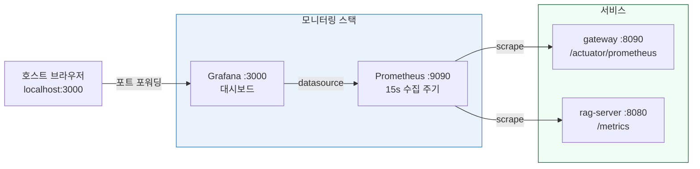

# 10. 모니터링 및 운영 (Monitoring & Operations)

> **Phase 9** | Prometheus + Grafana + 운영 지침

---

## 1. 모니터링 아키텍처



---

## 2. STEP 18 — Prometheus + Grafana 설정

### prometheus.yml

```yaml
# /ai-system/config/prometheus.yml
global:
  scrape_interval: 15s
  evaluation_interval: 15s

scrape_configs:
  - job_name: gateway
    static_configs:
      - targets: ['gateway:8090']
    metrics_path: /actuator/prometheus

  - job_name: rag-server
    static_configs:
      - targets: ['rag-server:8080']
    metrics_path: /metrics
```

### Grafana 초기 접근
- URL: `http://localhost:3000`
- 기본 계정: `admin` / `admin`
- Datasource 추가: Prometheus → `http://prometheus:9090`

---

## 3. STEP 19 — VM 리소스 모니터링

### 컨테이너별 실시간 모니터링

```bash
# VM 내부에서
# 컨테이너별 RAM/CPU 실시간 확인 (2초마다 갱신)
watch -n 2 'docker stats --no-stream --format \
  "table {{.Name}}\t{{.MemUsage}}\t{{.CPUPerc}}"'
```

### Ollama 추론 속도 측정

```bash
curl -s http://localhost:11434/api/generate \
  -d '{"model":"exaone","prompt":"한국의 수도는?","stream":false}' \
  | python3 -c "
import sys, json
d = json.load(sys.stdin)
tps = d['eval_count'] / d['eval_duration'] * 1e9
print(f'추론 속도: {tps:.1f} tok/s')
print(f'총 토큰: {d[\"eval_count\"]}')
"
```

### 전체 메모리 확인

```bash
# VM 전체 메모리 사용량
free -h

# Docker 볼륨 디스크 사용량
docker system df
```

---

## 4. SLA 목표 (Vagrant VM + CPU 환경)

| 항목 | GPU 서버 목표 | **Vagrant VM CPU 현실적 목표** |
|------|-------------|---------------------------|
| LLM 첫 토큰 지연 P50 | < 1초 | **< 10초** |
| LLM 첫 토큰 지연 P99 | < 5초 | **< 40초** |
| RAG 검색 지연 | < 200ms | **< 600ms** |
| 임베딩 처리 속도 | ~1,000 doc/min | **~2 doc/min** |
| 동시 사용자 | 80~120명 | **1~3명** |
| 시스템 가용성 | 99.9% | **99% (VM 재시작 포함)** |

---

## 5. 주요 알람 기준

| 알람 | 조건 | 조치 |
|------|------|------|
| 메모리 부족 | VM 메모리 > 18GB | Q3_K_M으로 교체, 불필요 서비스 축소 |
| 컨테이너 재시작 | restart count > 3 | `docker compose logs <서비스명>` 확인 |
| Ollama 무응답 | /api/tags 200ms 초과 | `docker compose restart ollama` |
| Milvus 연결 실패 | pymilvus 연결 오류 | etcd, minio 상태 확인 |

---

## 6. 로그 확인 명령어

```bash
# 전체 서비스 로그 (실시간)
docker compose logs -f

# 특정 서비스 로그
docker compose logs -f rag-server
docker compose logs -f ollama
docker compose logs -f gateway

# 최근 100줄
docker compose logs --tail=100 rag-server
```

---

## 7. 백업 및 복구

### VM 스냅샷 (호스트에서)

```bash
# 스냅샷 저장 (vagrant halt 후 권장)
vagrant snapshot save "stable-v1"

# 스냅샷 복원
vagrant snapshot restore "stable-v1"

# 스냅샷 목록
vagrant snapshot list
```

### Docker 볼륨 백업

```bash
# PostgreSQL 백업
docker exec ai-system-postgres-1 pg_dump -U postgres ai_system > backup.sql

# Milvus 데이터 (중단 후 볼륨 복사)
docker compose stop milvus
docker run --rm -v ai-system_milvus_data:/data \
  -v $(pwd):/backup ubuntu \
  tar czf /backup/milvus_backup.tar.gz /data
```
