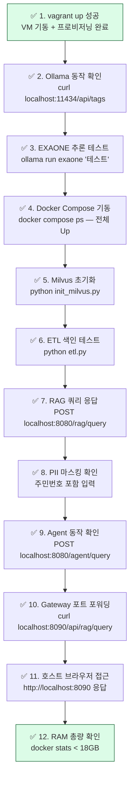

# 11. 통합 테스트 체크리스트 (Integration Test)

> E2E 테스트 절차 및 검증 스크립트

---

## 1. 통합 테스트 체크리스트



---

## 2. 단계별 수동 검증 명령어

### Step 1~3: VM 및 Ollama 확인

```bash
# 호스트에서
vagrant up
vagrant status

# VM 접속 후
vagrant ssh

# Ollama 상태
curl -s http://localhost:11434/api/tags | python3 -m json.tool

# EXAONE 추론 테스트
curl -s http://localhost:11434/api/generate \
  -d '{"model":"exaone","prompt":"안녕하세요","stream":false}' \
  | python3 -m json.tool
```

### Step 4~5: Docker 스택 확인

```bash
# 전체 서비스 상태
docker compose ps

# Milvus 초기화
source /ai-system/.venv/bin/activate
python /ai-system/init_milvus.py
```

### Step 6~9: 기능 검증

```bash
# RAG 헬스체크
curl -s http://localhost:8080/health

# RAG 쿼리
curl -s -X POST http://localhost:8080/rag/query \
  -H "Content-Type: application/json" \
  -d '{"query": "EXAONE 모델에 대해 설명해주세요", "session_id": "test-001"}'

# PII 마스킹 확인 — 응답에 원본 전화번호가 없어야 함
curl -s -X POST http://localhost:8080/rag/query \
  -H "Content-Type: application/json" \
  -d '{"query": "010-1234-5678 로 연락해주세요", "session_id": "test-pii"}'

# Agent 쿼리
curl -s -X POST http://localhost:8080/agent/query \
  -H "Content-Type: application/json" \
  -d '{"query": "오늘 날짜와 2의 제곱근을 알려주세요"}'
```

---

## 3. E2E 자동화 스크립트

```bash
#!/bin/bash
# /ai-system/test_e2e.sh
# VM 내부에서 실행: bash /ai-system/test_e2e.sh

set -e
BASE="http://localhost:8080"
GW="http://localhost:8090"
PASS=0
FAIL=0

check() {
  local name="$1"
  local result="$2"
  local expected="$3"
  if echo "$result" | grep -q "$expected"; then
    echo "✅ PASS: $name"
    PASS=$((PASS+1))
  else
    echo "❌ FAIL: $name"
    echo "   Got: $result"
    FAIL=$((FAIL+1))
  fi
}

echo "━━━━━━━━━━━━━━━━━━━━━━━━━━━━━━"
echo "🧪 AI System E2E Test Suite"
echo "━━━━━━━━━━━━━━━━━━━━━━━━━━━━━━"

echo ""
echo "1. Ollama 상태 확인"
R=$(curl -s http://localhost:11434/api/tags)
check "Ollama API 응답" "$R" "models"

echo ""
echo "2. RAG 서버 헬스체크"
R=$(curl -s $BASE/health)
check "RAG Health" "$R" "ok"

echo ""
echo "3. RAG 쿼리 테스트"
R=$(curl -s -X POST $BASE/rag/query \
  -H "Content-Type: application/json" \
  -d '{"query": "테스트 질문입니다", "session_id": "test-001"}')
check "RAG 응답 존재" "$R" "."

echo ""
echo "4. Agent 쿼리 테스트"
R=$(curl -s -X POST $BASE/agent/query \
  -H "Content-Type: application/json" \
  -d '{"query": "오늘 날짜를 알려주세요"}')
check "Agent answer 필드" "$R" "answer"

echo ""
echo "5. PII 마스킹 확인"
R=$(curl -s -X POST $BASE/rag/query \
  -H "Content-Type: application/json" \
  -d '{"query": "010-1234-5678 로 연락해주세요", "session_id": "test-pii"}')
check "PII 마스킹 (원본 번호 없음)" "$(echo $R | grep -v '010-1234-5678')" "."

echo ""
echo "6. 컨테이너 RAM 사용량"
docker stats --no-stream --format "{{.Name}}: {{.MemUsage}}"

echo ""
echo "━━━━━━━━━━━━━━━━━━━━━━━━━━━━━━"
echo "결과: PASS=$PASS / FAIL=$FAIL"
echo "━━━━━━━━━━━━━━━━━━━━━━━━━━━━━━"
```

```bash
chmod +x /ai-system/test_e2e.sh
/ai-system/test_e2e.sh
```

---

## 4. 성능 벤치마크 스크립트

```bash
#!/bin/bash
# /ai-system/benchmark.sh
# 추론 속도 및 RAG 지연 측정

echo "=== Ollama 추론 속도 ==="
curl -s http://localhost:11434/api/generate \
  -d '{"model":"exaone","prompt":"한국의 역사에 대해 3문장으로 설명해주세요","stream":false}' \
  | python3 -c "
import sys, json
d = json.load(sys.stdin)
tps = d['eval_count'] / d['eval_duration'] * 1e9
ttft = d.get('prompt_eval_duration', 0) / 1e9
print(f'첫 토큰 지연: {ttft:.2f}초')
print(f'추론 속도: {tps:.1f} tok/s')
print(f'총 토큰: {d[\"eval_count\"]}')
"

echo ""
echo "=== RAG 검색 지연 ==="
time curl -s -X POST http://localhost:8080/rag/query \
  -H "Content-Type: application/json" \
  -d '{"query": "테스트", "session_id": "bench"}' > /dev/null
```

---

## 5. 체크리스트 요약 표

| # | 항목 | 성공 조건 | 상태 |
|---|------|---------|------|
| 1 | vagrant up | VM 기동 완료 | ☐ |
| 2 | Ollama API | `/api/tags` 200 응답 | ☐ |
| 3 | EXAONE 추론 | 한국어 응답 생성 | ☐ |
| 4 | Docker Compose | 전체 서비스 Up | ☐ |
| 5 | Milvus 초기화 | knowledge_base 컬렉션 생성 | ☐ |
| 6 | ETL 색인 | chunks ingested 메시지 | ☐ |
| 7 | RAG 쿼리 | 스트리밍 응답 수신 | ☐ |
| 8 | PII 마스킹 | 원본 개인정보 미노출 | ☐ |
| 9 | Agent | `answer` 필드 응답 | ☐ |
| 10 | Gateway | `/api/rag/query` 정상 라우팅 | ☐ |
| 11 | 호스트 접근 | localhost:8090 응답 | ☐ |
| 12 | RAM | docker stats 합계 < 18GB | ☐ |

---

## 5. ETL 완료 후 검색 E2E 테스트

ETL 파이프라인 실행 후 검색이 정상 동작하는지 검증합니다.

### 검색 전 사전 확인

```bash
# Milvus 벡터 수 확인 (0이면 ETL 미실행)
docker exec ai-system-airflow-scheduler python3 -c "
from pymilvus import connections, Collection
connections.connect(host='milvus', port=19530)
print('벡터 수:', Collection('knowledge_base').num_entities)
"

# PostgreSQL 문서 메타 확인
docker exec ai-system-postgres-1 psql -U postgres -d ai_system \
  -c "SELECT source, chunk_count, pii_count, indexed_at FROM document_meta;"
```

### 검색 테스트 실행

```bash
# 종합 검색 E2E 테스트 스크립트
bash /ai-system/test_search.sh
```

### 단계별 검색 검증

```bash
# 1. RAG 직접 검색 (RAG Server)
curl -N -X POST http://localhost:8080/rag/query \
  -H "Content-Type: application/json" \
  -d '{"query": "색인된 문서 내용에 대해 설명해주세요", "session_id": "verify-001"}'

# 2. Agent 검색
curl -s -X POST http://localhost:8080/agent/query \
  -H "Content-Type: application/json" \
  -d '{"query": "현재 색인된 문서 수와 소스 경로를 알려주세요"}' \
  | python3 -m json.tool

# 3. 멀티턴 대화
curl -s -X POST http://localhost:8080/rag/query \
  -H "Content-Type: application/json" \
  -d '{"query": "ETL 파이프라인이 뭔가요?", "session_id": "multi-001"}' > /dev/null

curl -N -X POST http://localhost:8080/rag/query \
  -H "Content-Type: application/json" \
  -d '{"query": "방금 설명한 내용을 더 자세히 알려주세요", "session_id": "multi-001"}'
```

### 체크리스트 추가 항목

| # | 항목 | 성공 조건 | 상태 |
|---|------|---------|------|
| 13 | ETL DAG 실행 | `ai_system_etl_v2` success | ☐ |
| 14 | Milvus 벡터 적재 | `num_entities > 0` | ☐ |
| 15 | PostgreSQL 메타 | `document_meta` 레코드 존재 | ☐ |
| 16 | RAG 검색 응답 | 스트리밍 응답 수신 | ☐ |
| 17 | Agent 검색 | `answer` 필드 포함 | ☐ |
| 18 | 멀티턴 대화 | 이전 맥락 반영 응답 | ☐ |
| 19 | 검색 E2E | `test_search.sh` 전체 PASS | ☐ |

자세한 검색 방법은 [14_search_guide.md](./14_search_guide.md) 참조.
