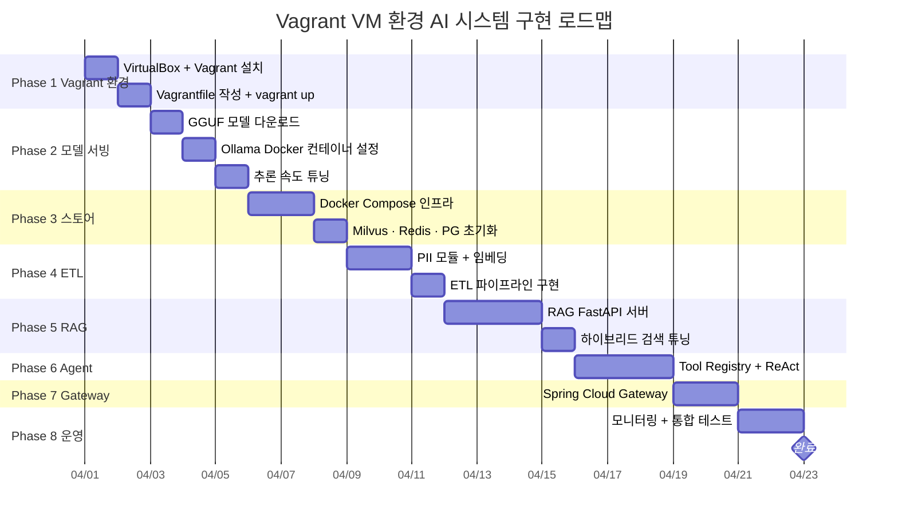

# 12. 운영 가이드 (Operations Guide)

> Vagrant 운영 명령어 · 트러블슈팅 · 로드맵

---

## 1. Vagrant 운영 명령어 치트시트

> **모든 vagrant 명령어는 호스트의 `~/ai-system/` 디렉토리에서 실행합니다.**

### VM 생명주기

```bash
vagrant up                     # VM 시작 (최초: 프로비저닝 포함)
vagrant halt                   # VM 정상 종료
vagrant reload                 # VM 재시작
vagrant reload --provision     # 재시작 + Vagrantfile 프로비저닝 재실행
vagrant destroy                # VM 완전 삭제 (데이터 유실 주의)
vagrant destroy && vagrant up  # 완전 초기화
```

### VM 접속

```bash
vagrant ssh                              # VM SSH 접속
vagrant ssh -c "docker compose ps"       # 단일 명령 실행
vagrant ssh -c "docker stats --no-stream" # 리소스 현황
```

### VM 상태 확인

```bash
vagrant status          # 현재 VM 상태
vagrant global-status   # 모든 Vagrant VM 목록
```

### 공유 폴더 재마운트

```bash
vagrant plugin install vagrant-vbguest   # Guest Additions 자동 관리
vagrant reload                           # 재마운트 적용
```

### 스냅샷 (VM 상태 저장)

```bash
vagrant snapshot save "before-etl"      # 스냅샷 저장
vagrant snapshot restore "before-etl"   # 스냅샷 복원
vagrant snapshot list                   # 스냅샷 목록
```

---

## 2. Docker 운영 명령어 (VM 내부)

```bash
# 전체 스택 시작/중지
cd /ai-system
docker compose up -d
docker compose down

# 특정 서비스 재시작
docker compose restart rag-server
docker compose restart ollama

# 로그 확인
docker compose logs -f rag-server
docker compose logs --tail=100 ollama

# 상태 및 리소스
docker compose ps
docker stats --no-stream

# Vagrant에서 직접 실행
vagrant ssh -c "cd /ai-system && docker compose up -d"
vagrant ssh -c "docker compose logs -f rag-server"
```

---

## 3. 흔한 문제 해결

| 증상 | 원인 | 해결 |
|------|------|------|
| `vagrant up` 실패 (VT-x 오류) | BIOS 가상화 비활성화 | BIOS에서 VT-x/AMD-V 활성화 |
| 공유 폴더 마운트 안 됨 | Guest Additions 버전 불일치 | `vagrant plugin install vagrant-vbguest` 후 `vagrant reload` |
| Ollama 응답 없음 | 컨테이너 미기동 or 모델 미등록 | `docker compose logs ollama` 확인 |
| `host.docker.internal` 미작동 | VirtualBox 네트워크 제약 | docker-compose.yml에서 서비스명 `ollama` 사용 (본 구현 적용됨) |
| RAM 부족으로 컨테이너 재시작 | VM 메모리 초과 | Vagrantfile `vb.memory` 확인, Q3_K_M 양자화로 교체 |
| 포트 포워딩 접근 안 됨 | 방화벽 또는 포트 충돌 | `vagrant reload`, 호스트 방화벽 규칙 확인 |
| Milvus 연결 실패 | etcd/minio 미기동 | `docker compose ps` → 의존 서비스 확인 후 재시작 |
| 임베딩 매우 느림 | BGE-M3 첫 로딩 | 최초 1회 warmup 시간 필요 (2~3분), 이후 정상화 |

---

## 4. 시스템 튜닝 팁

### RAM 절약 방법

```bash
# Q3_K_M으로 교체 (RAM 4GB, 속도 향상)
# ~/ai-system/models 에서 Q3_K_M 다운로드 후 Modelfile 수정
FROM /ai-system/models/EXAONE-3.5-7.8B-Instruct-Q3_K_M.gguf

# 사용하지 않는 컨테이너 중지
docker compose stop prometheus grafana
```

### CPU 성능 최적화

```bash
# Vagrantfile: vb.cpus 조정 (최대 물리코어-2 권장)
vb.cpus = 12  # 16코어 호스트에서 안정적 운영

# Modelfile: num_thread를 vCPU 수와 맞춤
PARAMETER num_thread 12
```

---

## 5. 구현 로드맵



> **총 예상 기간**: 약 3~4주 (1인 개발 기준)

---

## 6. 환경 정보

| 항목 | 값 |
|------|-----|
| Vagrant | 2.4.0+ |
| VirtualBox | 7.0+ |
| Ubuntu | 22.04 LTS (jammy64) |
| Docker Compose | v2 |
| Python | 3.11 |
| JDK | 21 (Eclipse Temurin) |
| 기준 문서 | AI_System_Architecture.md v3.0 |
| 최종 업데이트 | 2026년 3월 |
