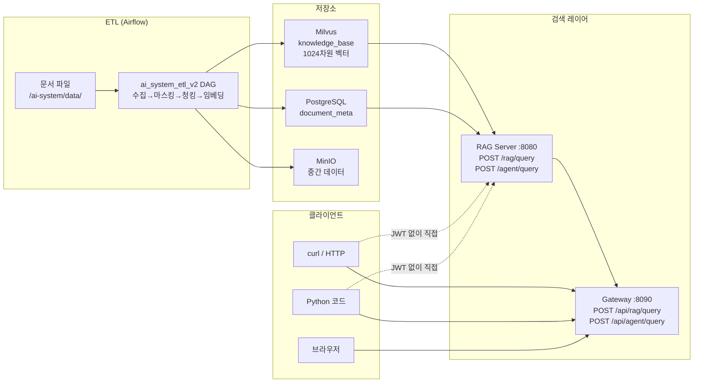
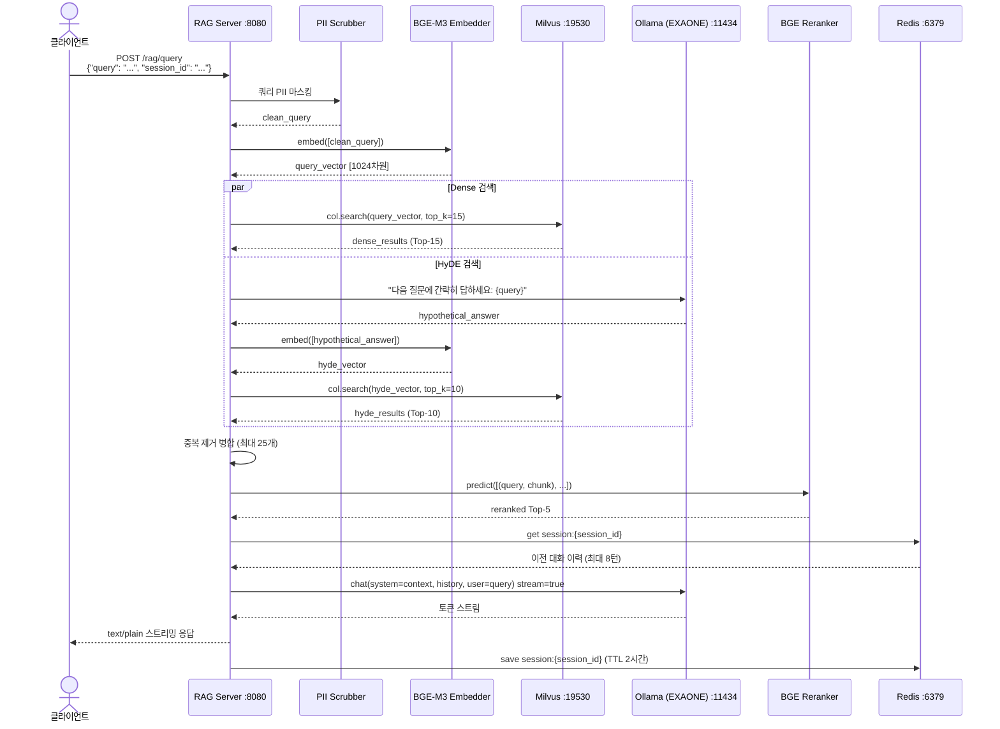
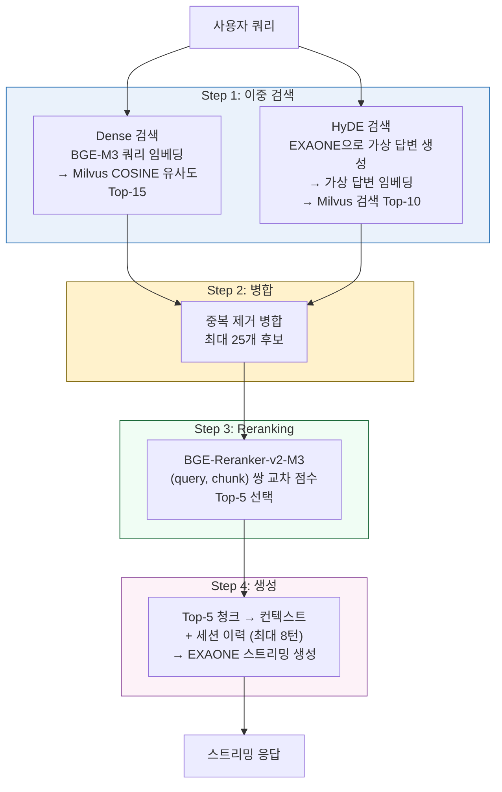
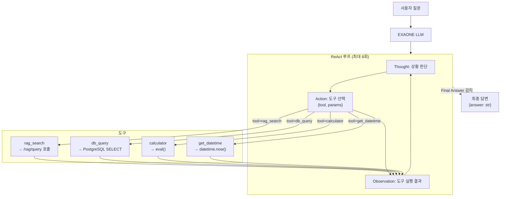
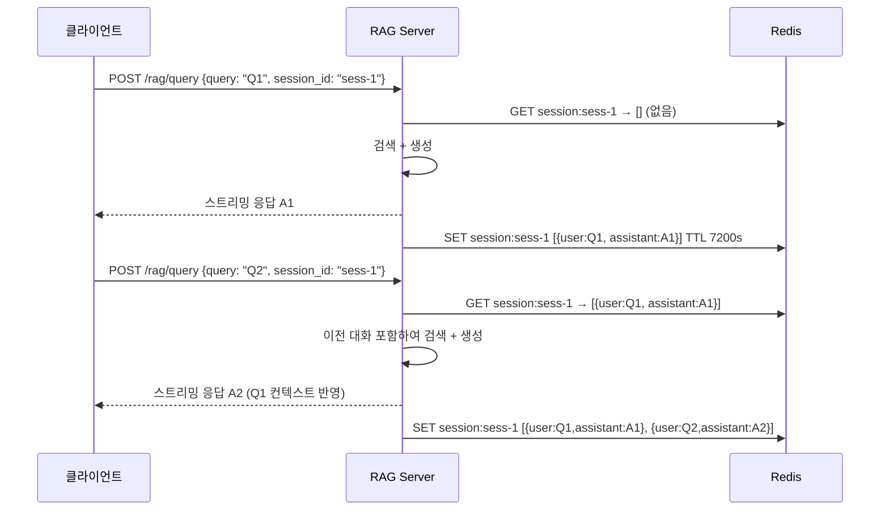

# 14. ETL 데이터 검색 가이드

> **ETL 적재 완료 후 RAG Server / Gateway를 통한 검색 방법 완전 가이드**  
> 버전: v1.0 | 작성일: 2026-03-15

---

## 목차

1. [검색 아키텍처 개요](#1-검색-아키텍처-개요)
2. [검색 파이프라인 상세](#2-검색-파이프라인-상세)
3. [RAG Server 직접 검색](#3-rag-server-직접-검색)
4. [Gateway를 통한 검색](#4-gateway를-통한-검색)
5. [Agent를 통한 검색](#5-agent를-통한-검색)
6. [세션 관리 (멀티턴 대화)](#6-세션-관리-멀티턴-대화)
7. [Python 클라이언트 예제](#7-python-클라이언트-예제)
8. [검색 결과 해석](#8-검색-결과-해석)
9. [검색 튜닝 가이드](#9-검색-튜닝-가이드)
10. [E2E 검색 테스트](#10-e2e-검색-테스트)


---

## 1. 검색 아키텍처 개요

### ETL → 검색 전체 흐름



### 접근 방법 비교

| 방법 | 엔드포인트 | 인증 | Rate Limit | PII 필터 | 사용 권장 |
|------|-----------|------|-----------|---------|---------|
| RAG Server 직접 | `http://localhost:8080` | 없음 | 없음 | RAG 내부 | 개발/테스트 |
| Gateway 경유 | `http://localhost:8090` | JWT 필요 | 있음 | 이중 적용 | 운영/외부 |

---

## 2. 검색 파이프라인 상세

### RAG 검색 내부 동작



### 3단계 검색 전략



---

## 3. RAG Server 직접 검색

> JWT 인증 없이 바로 사용 가능. **개발/테스트 환경 전용**.

### 3.1 헬스체크

```bash
curl -s http://localhost:8080/health
# {"status":"ok","timestamp":1710460800}
```

### 3.2 기본 RAG 쿼리

```bash
curl -X POST http://localhost:8080/rag/query \
  -H "Content-Type: application/json" \
  -d '{
    "query": "AI 시스템 테스트에 대해 설명해주세요",
    "session_id": "my-session-001"
  }'
```

**응답**: `text/plain` 스트리밍 — 터미널에 실시간으로 토큰이 출력됩니다.

### 3.3 스트리밍 응답 실시간 출력

```bash
# -N 옵션으로 버퍼링 비활성화 → 실시간 스트림 출력
curl -N -X POST http://localhost:8080/rag/query \
  -H "Content-Type: application/json" \
  -d '{
    "query": "RAG 파이프라인 동작 원리를 설명해주세요",
    "session_id": "stream-test"
  }'
```

### 3.4 멀티턴 대화 (세션 유지)

```bash
# 1번째 질문
curl -N -X POST http://localhost:8080/rag/query \
  -H "Content-Type: application/json" \
  -d '{"query": "이 시스템에서 ETL이란 무엇인가요?", "session_id": "conv-001"}'

echo "---"

# 2번째 질문 (같은 session_id → 이전 대화 기억)
curl -N -X POST http://localhost:8080/rag/query \
  -H "Content-Type: application/json" \
  -d '{"query": "방금 설명한 ETL에서 PII 마스킹은 어떻게 동작하나요?", "session_id": "conv-001"}'
```

### 3.5 응답을 파일로 저장

```bash
curl -s -X POST http://localhost:8080/rag/query \
  -H "Content-Type: application/json" \
  -d '{"query": "문서 청킹 방법을 설명해주세요", "session_id": "save-test"}' \
  > answer.txt

cat answer.txt
```

### 3.6 PII 포함 쿼리 테스트

```bash
# 쿼리의 전화번호가 마스킹되어 처리됨
curl -N -X POST http://localhost:8080/rag/query \
  -H "Content-Type: application/json" \
  -d '{"query": "010-1234-5678 로 연락한 고객 정보가 있나요?", "session_id": "pii-test"}'

# 응답에 원본 번호가 포함되지 않아야 함
```

---

## 4. Gateway를 통한 검색

> JWT 인증 + Rate Limiting + PII 이중 필터 적용. **운영 환경 권장**.

### 4.1 Gateway 라우팅 규칙

| 외부 경로 | 내부 경로 | 대상 | Rate Limit |
|---------|---------|------|-----------|
| `POST /api/rag/query` | `POST /rag/query` | rag-server:8080 | 10 req/s, burst 20 |
| `POST /api/agent/query` | `POST /agent/query` | rag-server:8080 | 5 req/s, burst 10 |
| `GET /actuator/health` | (직접) | gateway 자체 | 없음 |

### 4.2 JWT 토큰 획득

Gateway는 Keycloak 또는 자체 IdP에서 발급한 JWT를 검증합니다.

```bash
# Keycloak에서 토큰 획득 예시
TOKEN=$(curl -s -X POST \
  http://localhost:8080/realms/ai/protocol/openid-connect/token \
  -H "Content-Type: application/x-www-form-urlencoded" \
  -d "grant_type=password&client_id=ai-client&username=user&password=pass" \
  | python3 -c "import sys,json; print(json.load(sys.stdin)['access_token'])")

echo "토큰: $TOKEN"
```

> **개발 환경 우회**: Keycloak이 없는 경우 `SecurityConfig.kt`의 `.anyExchange().authenticated()` 를  
> `.anyExchange().permitAll()` 로 변경 후 Gateway 재빌드하면 JWT 없이 사용 가능합니다.

### 4.3 Gateway를 통한 RAG 쿼리

```bash
# JWT 토큰 필요
curl -N -X POST http://localhost:8090/api/rag/query \
  -H "Content-Type: application/json" \
  -H "Authorization: Bearer $TOKEN" \
  -d '{
    "query": "ETL 파이프라인에 대해 설명해주세요",
    "session_id": "gw-session-001"
  }'
```

### 4.4 개발 환경에서 JWT 없이 Gateway 사용

`SecurityConfig.kt` 임시 수정:

```kotlin
// SecurityConfig.kt — 개발용 (운영 시 반드시 원복)
.authorizeExchange { exchanges ->
    exchanges
        .pathMatchers("/actuator/health", "/actuator/info").permitAll()
        .anyExchange().permitAll()  // ← JWT 인증 비활성화
}
// .oauth2ResourceServer { ... }  // ← 이 블록 주석 처리
```

Gateway 재빌드:

```bash
docker compose build gateway
docker compose up -d gateway
```

JWT 없이 직접 호출:

```bash
curl -N -X POST http://localhost:8090/api/rag/query \
  -H "Content-Type: application/json" \
  -d '{"query": "테스트 질문입니다", "session_id": "dev-test"}'
```

### 4.5 Gateway 헬스체크

```bash
curl -s http://localhost:8090/actuator/health
# {"status":"UP","components":{"diskSpace":{"status":"UP"},...}}
```

### 4.6 Rate Limit 확인

```bash
# Rate Limit 초과 시 429 응답
for i in {1..25}; do
  STATUS=$(curl -s -o /dev/null -w "%{http_code}" \
    -X POST http://localhost:8090/api/rag/query \
    -H "Content-Type: application/json" \
    -H "Authorization: Bearer $TOKEN" \
    -d '{"query": "테스트", "session_id": "rate-test"}')
  echo "요청 $i: HTTP $STATUS"
done
```

---

## 5. Agent를 통한 검색

Agent는 ReAct(Reason + Act) 패턴으로 여러 도구를 조합하여 복잡한 질문에 답합니다.

### 5.1 사용 가능한 도구

| 도구명 | 설명 | 파라미터 |
|--------|------|---------|
| `rag_search` | Milvus 벡터 검색 | `query: str` |
| `db_query` | PostgreSQL SELECT | `sql: str` |
| `calculator` | 수식 계산 | `expression: str` |
| `get_datetime` | 현재 날짜/시각 | 없음 |

### 5.2 Agent 동작 흐름



### 5.3 Agent 쿼리 예제

```bash
# RAG 서버 직접
curl -s -X POST http://localhost:8080/agent/query \
  -H "Content-Type: application/json" \
  -d '{"query": "오늘 날짜와 현재 색인된 문서 수를 알려주세요"}'

# 예상 Agent 동작:
# Thought: 날짜는 get_datetime, 문서 수는 db_query로 조회 가능
# Action: {"tool": "get_datetime", "params": {}}
# Observation: 2026년 03월 15일 09시 00분
# Action: {"tool": "db_query", "params": {"sql": "SELECT COUNT(*) FROM document_meta"}}
# Observation: [{"count": 1}]
# Final Answer: 오늘은 2026년 03월 15일이며, 현재 1개의 문서가 색인되어 있습니다.
```

```bash
# 복합 질문 — RAG 검색 + 계산
curl -s -X POST http://localhost:8080/agent/query \
  -H "Content-Type: application/json" \
  -d '{"query": "시스템에서 사용하는 임베딩 차원 수의 제곱근은 얼마인가요?"}'

# 예상 동작:
# rag_search("임베딩 차원") → "BGE-M3 1024차원"
# calculator("1024 ** 0.5") → "32.0"
# Final Answer: 1024차원의 제곱근은 32입니다.
```

```bash
# Gateway 경유 Agent
curl -s -X POST http://localhost:8090/api/agent/query \
  -H "Content-Type: application/json" \
  -H "Authorization: Bearer $TOKEN" \
  -d '{"query": "색인된 문서의 소스 경로를 알려주세요"}'
```

### 5.4 Agent 응답 포맷

Agent는 스트리밍이 아닌 **JSON 단일 응답**을 반환합니다:

```json
{
  "answer": "현재 색인된 문서는 /ai-system/data/test_doc.txt 1개입니다."
}
```

---

## 6. 세션 관리 (멀티턴 대화)

### 세션 정책

| 항목 | 값 |
|------|----|
| 저장소 | Redis (`session:{session_id}` 키) |
| TTL | 2시간 (7200초) |
| 최대 이력 | 8턴 (16 메시지 = user 8 + assistant 8) |
| 직렬화 | JSON |

### 세션 흐름



### 세션 확인 및 관리

```bash
# 세션 내용 확인 (Redis CLI)
docker exec ai-system-redis-1 redis-cli \
  -a changeme GET "session:my-session-001"

# 세션 삭제 (대화 초기화)
docker exec ai-system-redis-1 redis-cli \
  -a changeme DEL "session:my-session-001"

# 전체 세션 목록
docker exec ai-system-redis-1 redis-cli \
  -a changeme KEYS "session:*"

# 세션 TTL 확인
docker exec ai-system-redis-1 redis-cli \
  -a changeme TTL "session:my-session-001"
```

---

## 7. Python 클라이언트 예제

### 7.1 기본 RAG 검색

```python
import httpx

def rag_query(query: str, session_id: str = "default") -> str:
    """RAG 서버에 쿼리 전송 (스트리밍 응답 수집)"""
    url = "http://localhost:8080/rag/query"
    
    with httpx.Client(timeout=120) as client:
        with client.stream("POST", url, json={
            "query": query,
            "session_id": session_id
        }) as response:
            result = ""
            for chunk in response.iter_text():
                print(chunk, end="", flush=True)
                result += chunk
    print()  # 줄바꿈
    return result

# 사용 예시
answer = rag_query(
    query="AI 시스템의 ETL 파이프라인에 대해 설명해주세요",
    session_id="python-session-001"
)
```

### 7.2 비동기 RAG 검색

```python
import asyncio
import httpx

async def rag_query_async(query: str, session_id: str = "default") -> str:
    """비동기 스트리밍 RAG 쿼리"""
    url = "http://localhost:8080/rag/query"
    
    async with httpx.AsyncClient(timeout=120) as client:
        async with client.stream("POST", url, json={
            "query": query,
            "session_id": session_id
        }) as response:
            result = ""
            async for chunk in response.aiter_text():
                print(chunk, end="", flush=True)
                result += chunk
    print()
    return result

# 실행
asyncio.run(rag_query_async(
    "Milvus 벡터 검색의 동작 원리를 설명해주세요",
    "async-session-001"
))
```

### 7.3 멀티턴 대화 클라이언트

```python
import httpx

class RAGChatClient:
    """멀티턴 대화 클라이언트"""
    
    def __init__(self, base_url: str = "http://localhost:8080",
                 session_id: str = "default"):
        self.base_url = base_url
        self.session_id = session_id
    
    def chat(self, query: str) -> str:
        """쿼리 전송 및 스트리밍 응답 출력"""
        print(f"\n[You]: {query}")
        print("[AI]: ", end="", flush=True)
        
        with httpx.Client(timeout=120) as client:
            with client.stream("POST", f"{self.base_url}/rag/query", json={
                "query": query,
                "session_id": self.session_id
            }) as response:
                result = ""
                for chunk in response.iter_text():
                    print(chunk, end="", flush=True)
                    result += chunk
        print()
        return result
    
    def reset_session(self):
        """세션 초기화 (새 session_id 부여)"""
        import uuid
        self.session_id = str(uuid.uuid4())
        print(f"세션 초기화: {self.session_id}")


# 대화형 루프
client = RAGChatClient(session_id="interactive-001")

questions = [
    "이 시스템의 ETL 파이프라인이란 무엇인가요?",
    "방금 설명한 파이프라인에서 PII 마스킹은 어떻게 동작하나요?",
    "청크 크기는 얼마로 설정되어 있나요?",
]

for q in questions:
    client.chat(q)
```

### 7.4 Agent 쿼리 클라이언트

```python
import httpx
import json

def agent_query(query: str, base_url: str = "http://localhost:8080") -> str:
    """Agent 쿼리 전송"""
    response = httpx.post(
        f"{base_url}/agent/query",
        json={"query": query},
        timeout=120
    )
    response.raise_for_status()
    return response.json()["answer"]

# 사용 예시
print(agent_query("현재 색인된 문서 수와 오늘 날짜를 알려주세요"))
print(agent_query("document_meta 테이블의 모든 데이터를 조회해주세요"))
```

### 7.5 Gateway 경유 클라이언트 (JWT 포함)

```python
import httpx

class GatewayClient:
    """JWT 인증 Gateway 클라이언트"""
    
    def __init__(self, gateway_url: str = "http://localhost:8090",
                 jwt_token: str = ""):
        self.gateway_url = gateway_url
        self.headers = {
            "Content-Type": "application/json",
            "Authorization": f"Bearer {jwt_token}" if jwt_token else ""
        }
    
    def rag_query(self, query: str, session_id: str = "default") -> str:
        with httpx.Client(timeout=120) as client:
            with client.stream(
                "POST",
                f"{self.gateway_url}/api/rag/query",
                json={"query": query, "session_id": session_id},
                headers=self.headers
            ) as response:
                result = ""
                for chunk in response.iter_text():
                    print(chunk, end="", flush=True)
                    result += chunk
        print()
        return result
    
    def agent_query(self, query: str) -> dict:
        response = httpx.post(
            f"{self.gateway_url}/api/agent/query",
            json={"query": query},
            headers=self.headers,
            timeout=120
        )
        return response.json()


# 개발 환경 (JWT 없이)
client = GatewayClient(jwt_token="")
client.rag_query("테스트 문서에 대해 설명해주세요", "gw-001")
```

---

## 8. 검색 결과 해석

### Milvus 검색 결과 직접 확인

```python
from pymilvus import connections, Collection
from rag_server.embedder import embed  # 로컬에서 실행 시

connections.connect(host="localhost", port=19530)
col = Collection("knowledge_base")
col.load()

# 쿼리 임베딩
query = "RAG 파이프라인이란"
# 임베딩은 rag-server 컨테이너에서 실행 권장
```

```bash
# Milvus 검색 직접 테스트 (컨테이너 내부)
docker exec ai-system-rag-server-1 python3 -c "
from pymilvus import connections, Collection
from embedder import embed

connections.connect(host='milvus', port=19530)
col = Collection('knowledge_base')
col.load()

query = 'RAG 파이프라인이란'
q_vec = embed([query])[0]

results = col.search(
    [q_vec], 'vector',
    {'metric_type': 'COSINE', 'params': {'ef': 64}},
    limit=5,
    output_fields=['content', 'source', 'content_hash']
)

print(f'=== 검색 결과 (Top-5) ===')
for i, hit in enumerate(results[0]):
    print(f'[{i+1}] 유사도: {hit.score:.4f}')
    print(f'    소스: {hit.entity.source}')
    print(f'    내용: {hit.entity.content[:100]}...')
    print()
"
```

### PostgreSQL 메타데이터 조회

```bash
# 색인된 문서 목록
docker exec ai-system-postgres-1 psql -U postgres -d ai_system -c "
SELECT 
    id,
    source,
    chunk_count,
    pii_count,
    indexed_at
FROM document_meta
ORDER BY indexed_at DESC;"

# 특정 문서 검색
docker exec ai-system-postgres-1 psql -U postgres -d ai_system -c "
SELECT * FROM document_meta 
WHERE source LIKE '%test%';"

# 통계
docker exec ai-system-postgres-1 psql -U postgres -d ai_system -c "
SELECT 
    COUNT(*) AS total_docs,
    SUM(chunk_count) AS total_chunks,
    SUM(pii_count) AS total_pii_masked,
    MAX(indexed_at) AS last_indexed
FROM document_meta;"
```

---

## 9. 검색 튜닝 가이드

### top_k 파라미터 조정

`main.py`에서 검색 품질과 속도를 조절할 수 있습니다:

```python
# /ai-system/rag_server/main.py

# Dense 검색 후보 수 (기본 15)
# 늘리면 → 더 많은 후보 → Reranker 품질 향상, 속도 저하
dense_r = vector_search(q_emb, top_k=15)

# HyDE 검색 후보 수 (기본 10)
hyde_r = hyde_search(clean_q, top_k=10)

# Reranker 최종 선택 수 (기본 5)
# 늘리면 → 더 많은 컨텍스트 → 답변 풍부, 토큰 증가
top_chunks = rerank(clean_q, candidates, top_n=5)
```

| 설정 | top_k (dense) | top_k (HyDE) | top_n (rerank) | 특성 |
|------|-------------|------------|---------------|------|
| 빠른 응답 | 10 | 5 | 3 | 속도 우선 |
| **기본값** | **15** | **10** | **5** | **균형** |
| 고품질 | 20 | 15 | 7 | 품질 우선 |

### EXAONE 생성 파라미터

```python
# main.py 스트리밍 옵션
json={
    "model": "exaone",
    "messages": messages,
    "stream": True,
    "options": {
        "num_predict": 1024,    # 최대 생성 토큰 수
        "temperature": 0.7,     # 창의성 (0=결정적, 1=창의적)
        "top_p": 0.9,           # nucleus sampling
        "repeat_penalty": 1.1,  # 반복 억제
    }
}
```

### 세션 이력 길이 조정

```python
# main.py
SESSION_TTL = 7200   # 세션 유지 시간 (초)
MAX_HISTORY = 8      # 최대 대화 이력 턴 수

# 긴 대화가 필요한 경우 늘림 (토큰 소모 증가)
messages.extend(history[-(MAX_HISTORY * 2):])
```

---

## 10. E2E 검색 테스트

### 전체 파이프라인 검증 스크립트

```bash
#!/bin/bash
# ETL 완료 후 검색 E2E 테스트
# 실행: bash /ai-system/test_search.sh

BASE="http://localhost:8080"
PASS=0; FAIL=0

check() {
    local name="$1" result="$2" expected="$3"
    if echo "$result" | grep -q "$expected"; then
        echo "  ✅ PASS: $name"; PASS=$((PASS+1))
    else
        echo "  ❌ FAIL: $name"
        echo "     Expected: '$expected'"
        echo "     Got: ${result:0:200}"
        FAIL=$((FAIL+1))
    fi
}

echo "╔══════════════════════════════════╗"
echo "║  ETL 검색 E2E 테스트              ║"
echo "╚══════════════════════════════════╝"

# 1. 헬스체크
echo ""
echo "━━━━ [1] RAG 서버 헬스체크"
R=$(curl -s --max-time 10 $BASE/health)
check "RAG Health" "$R" "ok"

# 2. Milvus 벡터 수 확인
echo ""
echo "━━━━ [2] Milvus 적재 확인"
R=$(docker exec ai-system-airflow-scheduler python3 -c "
from pymilvus import connections, Collection
connections.connect(host='milvus', port=19530)
print(Collection('knowledge_base').num_entities)
" 2>/dev/null)
if [ "$R" -gt "0" ] 2>/dev/null; then
    echo "  ✅ PASS: Milvus 벡터 수 = $R"
    PASS=$((PASS+1))
else
    echo "  ❌ FAIL: Milvus 벡터 없음 (ETL 실행 필요)"
    FAIL=$((FAIL+1))
fi

# 3. RAG 검색 응답 확인
echo ""
echo "━━━━ [3] RAG 검색 테스트"
R=$(curl -s --max-time 120 -X POST $BASE/rag/query \
    -H "Content-Type: application/json" \
    -d '{"query": "테스트 문서에 대해 설명해주세요", "session_id": "e2e-001"}')
check "RAG 응답 존재" "$R" "."

# 4. PII 마스킹 확인
echo ""
echo "━━━━ [4] PII 마스킹 확인"
R=$(curl -s --max-time 120 -X POST $BASE/rag/query \
    -H "Content-Type: application/json" \
    -d '{"query": "010-1234-5678 번호로 연락하세요", "session_id": "e2e-pii"}')
if echo "$R" | grep -q "010-1234-5678"; then
    echo "  ❌ FAIL: PII 마스킹 실패 (원본 번호 노출)"
    FAIL=$((FAIL+1))
else
    echo "  ✅ PASS: PII 마스킹 정상 (원본 번호 미노출)"
    PASS=$((PASS+1))
fi

# 5. 멀티턴 대화 테스트
echo ""
echo "━━━━ [5] 멀티턴 대화 테스트"
curl -s --max-time 120 -X POST $BASE/rag/query \
    -H "Content-Type: application/json" \
    -d '{"query": "이 시스템의 데이터베이스는 무엇인가요?", "session_id": "e2e-multi"}' > /dev/null
R=$(curl -s --max-time 120 -X POST $BASE/rag/query \
    -H "Content-Type: application/json" \
    -d '{"query": "방금 언급한 데이터베이스의 포트 번호는?", "session_id": "e2e-multi"}')
check "멀티턴 응답 존재" "$R" "."

# 6. Agent 테스트
echo ""
echo "━━━━ [6] Agent 테스트"
R=$(curl -s --max-time 120 -X POST $BASE/agent/query \
    -H "Content-Type: application/json" \
    -d '{"query": "오늘 날짜를 알려주세요"}')
check "Agent answer 필드" "$R" "answer"

# 7. PostgreSQL 메타 확인
echo ""
echo "━━━━ [7] 메타데이터 확인"
R=$(docker exec ai-system-postgres-1 psql -U postgres -d ai_system \
    -t -c "SELECT COUNT(*) FROM document_meta;" 2>/dev/null | tr -d ' ')
if [ "$R" -gt "0" ] 2>/dev/null; then
    echo "  ✅ PASS: document_meta 레코드 수 = $R"
    PASS=$((PASS+1))
else
    echo "  ❌ FAIL: document_meta 레코드 없음"
    FAIL=$((FAIL+1))
fi

echo ""
echo "╔══════════════════════════════════╗"
echo "║  결과: PASS=$PASS FAIL=$FAIL      ║"
[ "$FAIL" -eq 0 ] && echo "║  🎉 모든 검색 테스트 통과!       ║" \
                  || echo "║  ⚠️  일부 테스트 실패            ║"
echo "╚══════════════════════════════════╝"

exit $FAIL
```

```bash
# 스크립트 실행
chmod +x /ai-system/test_search.sh
bash /ai-system/test_search.sh
```

---

## 부록: 빠른 참조

### 자주 쓰는 검색 명령어

```bash
# RAG 단순 쿼리
curl -s -X POST http://localhost:8080/rag/query \
  -H "Content-Type: application/json" \
  -d '{"query": "YOUR_QUESTION", "session_id": "test"}' | head -c 500

# RAG 스트리밍 실시간 출력
curl -N -X POST http://localhost:8080/rag/query \
  -H "Content-Type: application/json" \
  -d '{"query": "YOUR_QUESTION", "session_id": "stream"}'

# Agent 쿼리
curl -s -X POST http://localhost:8080/agent/query \
  -H "Content-Type: application/json" \
  -d '{"query": "YOUR_QUESTION"}' | python3 -m json.tool

# Milvus 벡터 수 확인
docker exec ai-system-airflow-scheduler python3 -c \
  "from pymilvus import connections,Collection; connections.connect(host='milvus',port=19530); print(Collection('knowledge_base').num_entities)"

# 색인 문서 목록
docker exec ai-system-postgres-1 psql -U postgres -d ai_system \
  -c "SELECT source, chunk_count, indexed_at FROM document_meta;"

# 세션 초기화
docker exec ai-system-redis-1 redis-cli -a changeme DEL "session:YOUR_SESSION_ID"
```