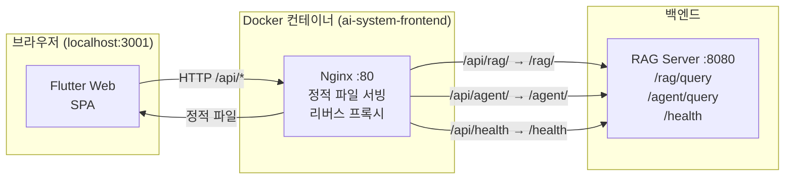
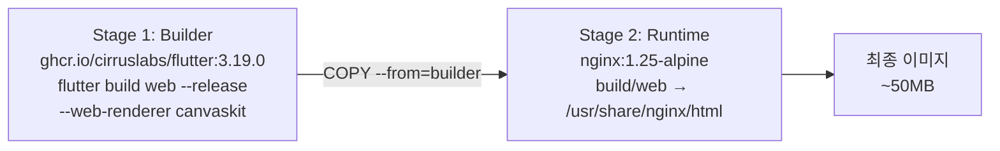
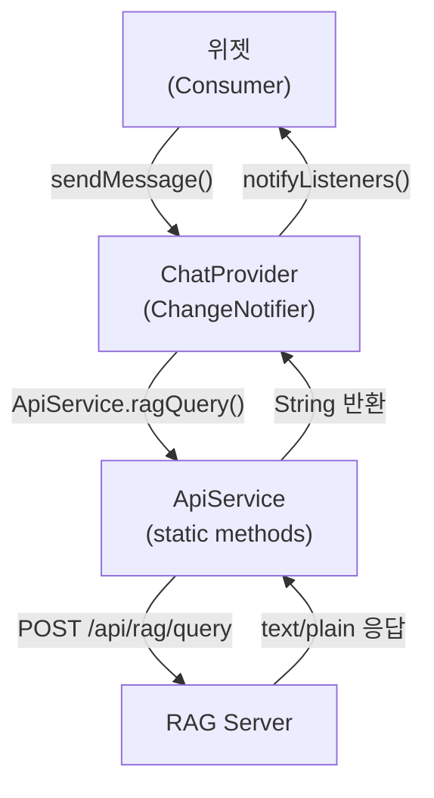
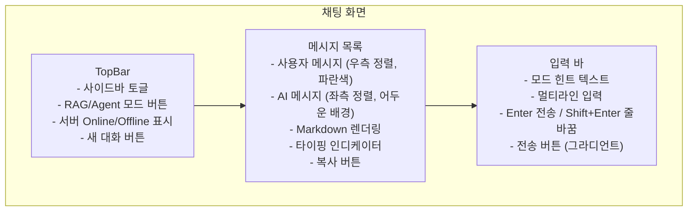
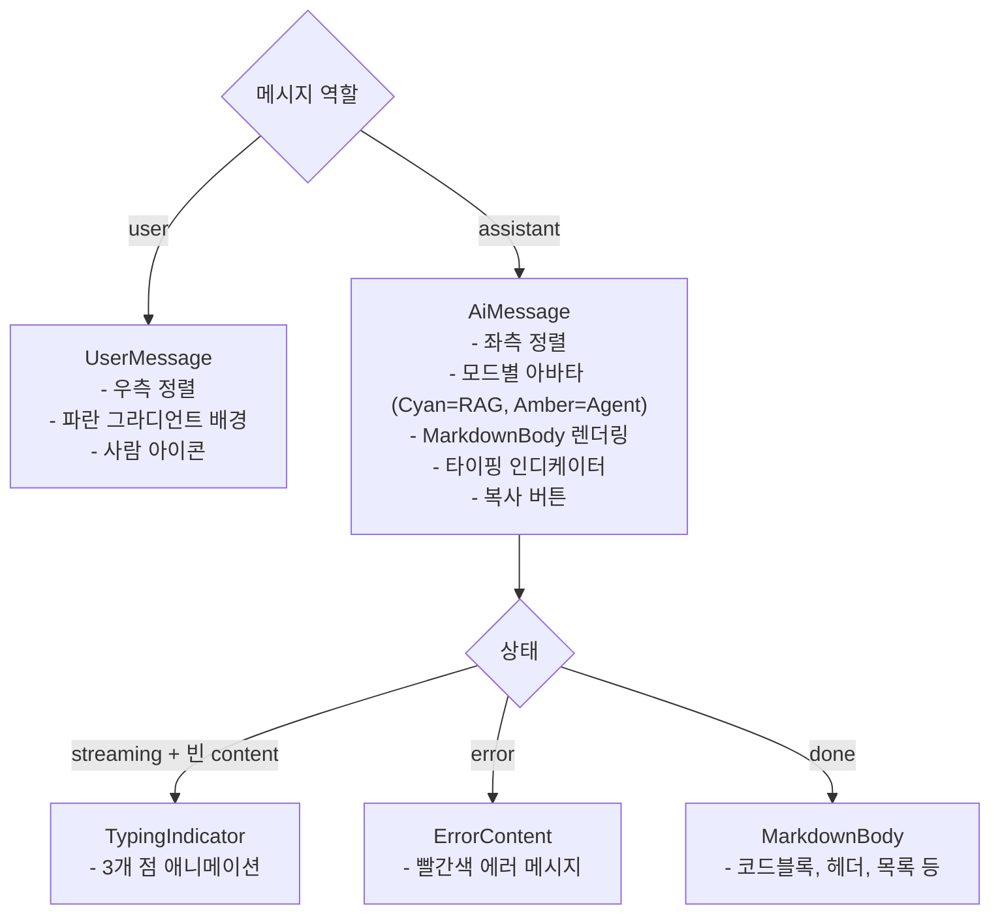
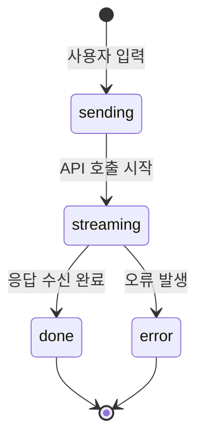

# AI RAG System Frontend 개발 산출물

> **프로젝트**: AI RAG System — Flutter Web Frontend  
> **버전**: v1.0.0  
> **작성일**: 2026-03-15  
> **기술 스택**: Flutter 3.19 · Dart 3.x · Nginx 1.25 · Docker

---

## 목차

1. [개요](#1-개요)
2. [기술 스택](#2-기술-스택)
3. [프로젝트 구조](#3-프로젝트-구조)
4. [아키텍처](#4-아키텍처)
5. [화면 설계](#5-화면-설계)
6. [컴포넌트 상세](#6-컴포넌트-상세)
7. [상태 관리](#7-상태-관리)
8. [API 연동](#8-api-연동)
9. [Nginx 프록시 설정](#9-nginx-프록시-설정)
10. [배포 가이드](#10-배포-가이드)
11. [테마 및 디자인 시스템](#11-테마-및-디자인-시스템)

---

## 1. 개요

### 목적

AI RAG System의 웹 프론트엔드로, 사용자가 브라우저에서 문서 기반 RAG 검색과 AI Agent 추론을 직관적으로 활용할 수 있는 채팅 UI를 제공합니다.

### 핵심 기능

- **RAG 모드** — 색인된 문서 기반 EXAONE 스트리밍 답변
- **Agent 모드** — ReAct 패턴 멀티툴 추론 (DB조회, 계산, 날짜, 벡터검색)
- **멀티턴 대화** — Redis 세션 기반 대화 이력 유지
- **문서 관리** — 색인된 문서 목록 및 통계 조회
- **시스템 상태** — 서비스 헬스체크 및 포트 현황 대시보드
- **Markdown 렌더링** — AI 응답 서식 표현 (헤더, 코드블록, 목록 등)
- **반응형 레이아웃** — 데스크톱/태블릿 대응

---

## 2. 기술 스택

| 분류 | 기술 | 버전 | 용도 |
|------|------|------|------|
| UI 프레임워크 | Flutter Web | 3.19.0 | SPA 웹 앱 |
| 언어 | Dart | 3.x | 앱 로직 |
| 상태 관리 | Provider | 6.1.1 | 전역 상태 |
| HTTP 통신 | http | 1.1.0 | REST API 호출 |
| Markdown | flutter_markdown | 0.6.18 | AI 응답 렌더링 |
| 폰트 | google_fonts | 6.1.0 | Space Grotesk |
| 애니메이션 | flutter_animate | 4.5.0 | 메시지 등장 효과 |
| UUID | uuid | 4.3.3 | 세션/메시지 ID |
| 날짜 포맷 | intl | 0.19.0 | 타임스탬프 표시 |
| 웹서버 | Nginx | 1.25-alpine | 정적 파일 서빙 + 프록시 |
| 컨테이너 | Docker | - | 멀티스테이지 빌드 |

---

## 3. 프로젝트 구조

```
ai-frontend/
├── lib/
│   ├── main.dart                    # 앱 진입점, Provider 설정
│   ├── theme/
│   │   └── app_theme.dart           # 다크 테마, 컬러 팔레트, ThemeData
│   ├── models/
│   │   └── chat_message.dart        # ChatMessage, ChatSession 모델
│   ├── services/
│   │   ├── api_service.dart         # RAG/Agent/Health API 호출
│   │   └── chat_provider.dart       # 전역 상태 관리 (ChangeNotifier)
│   ├── screens/
│   │   ├── main_screen.dart         # 메인 레이아웃 (NavRail + 탭)
│   │   ├── documents_screen.dart    # 색인 문서 목록 화면
│   │   └── status_screen.dart       # 시스템 상태 대시보드
│   └── widgets/
│       ├── top_bar.dart             # 상단 바 (모드 토글, 서버 상태)
│       ├── sidebar.dart             # 대화 이력 사이드바
│       ├── chat_area.dart           # 채팅 메시지 목록 + 환영 화면
│       ├── message_bubble.dart      # 사용자/AI 메시지 버블
│       └── input_bar.dart          # 텍스트 입력 + 전송 버튼
├── web/
│   ├── index.html                   # Flutter Web 진입점 (로딩 화면)
│   └── manifest.json                # PWA 매니페스트
├── nginx/
│   └── nginx.conf                   # Nginx 설정 (프록시, 캐싱, gzip)
├── Dockerfile                       # 멀티스테이지 빌드 (Flutter → Nginx)
├── pubspec.yaml                     # 패키지 의존성
└── README.md                        # 빠른 시작 가이드
```

**총 소스 코드**: 2,713줄 (Dart 파일 기준)

---

## 4. 아키텍처

### 전체 구성도



### 멀티스테이지 Docker 빌드



### 상태 관리 흐름



---

## 5. 화면 설계

### 5.1 전체 레이아웃

```
┌──┬─────────────────────────────────────────────────┐
│  │  TopBar: [로고] [RAG|Agent 토글] [서버상태] [새대화] │
│N │─────────────────────────────────────────────────│
│a │       │                                         │
│v ├───────┤         채팅 메시지 영역                 │
│R │       │                                         │
│a │ 대화  │  ┌─────────────────────────────────┐   │
│i │ 이력  │  │  AI 메시지 버블 (Markdown)       │   │
│l │       │  └─────────────────────────────────┘   │
│  │ 세션  │         ↑                               │
│  │ 목록  │  ┌─────────────────────────────┐       │
│  │       │  │         사용자 메시지        │       │
│  │       │  └─────────────────────────────┘       │
│  │─────────────────────────────────────────────────│
│  │         [입력창 ................] [전송버튼]     │
└──┴─────────────────────────────────────────────────┘
```

### 5.2 탭 구성

| 탭 | 아이콘 | 화면 |
|---|--------|------|
| 채팅 | `chat_bubble` | RAG/Agent 대화 |
| 문서 | `folder` | 색인 문서 목록/통계 |
| 상태 | `monitor_heart` | 서비스 헬스/포트 안내 |

### 5.3 채팅 화면 상세



### 5.4 문서 화면

- 통계 카드 3개 (총 문서 수, 총 청크 수, PII 마스킹 건수)
- 파일명 검색 필터
- 문서 카드 목록 (파일 타입 아이콘, 소스 경로, 청크 수, PII 배지, 색인 시각)

### 5.5 상태 화면

- 전체 시스템 상태 배너 (Online/Offline)
- 서비스 그리드 (10개 서비스 카드)
- 포트 안내 테이블

---

## 6. 컴포넌트 상세

### 6.1 main.dart
```dart
// Provider 루트 설정
ChangeNotifierProvider(
  create: (_) => ChatProvider(),
  child: MaterialApp(theme: AppTheme.dark, home: MainScreen()),
)
```

### 6.2 MainScreen
- `NavigationRail` 방식 좌측 탭 (60px 고정폭)
- `IndexedStack`으로 탭 상태 유지 (불필요한 rebuild 방지)
- 900px 이상에서 사이드바 표시

### 6.3 TopBar

| 요소 | 기능 |
|------|------|
| 사이드바 토글 버튼 | 대화 이력 사이드바 열기/닫기 |
| AI RAG System 로고 | 그라디언트 아이콘 + 텍스트 |
| RAG/Agent 토글 | 쿼리 모드 전환 (색상 구분) |
| 서버 상태 dot | Green/Red + Online/Offline 텍스트 |
| 새 대화 버튼 | 새 세션 생성 |

### 6.4 MessageBubble



**입장 애니메이션**: `FadeTransition` + `SlideTransition` (300ms)

### 6.5 InputBar

| 기능 | 구현 |
|------|------|
| Enter 전송 | `KeyboardListener` + `LogicalKeyboardKey.enter` |
| Shift+Enter 줄바꿈 | `HardwareKeyboard.isShiftPressed` 체크 |
| 전송 버튼 활성화 | 텍스트 유무에 따라 그라디언트/비활성 전환 |
| 로딩 중 | `CircularProgressIndicator` 표시, 입력 비활성화 |
| 모드 힌트 | RAG/Agent 모드에 따라 다른 안내 텍스트 |

### 6.6 Sidebar

- 세션 목록 (`ListView`)
- 세션 아이템 호버 효과 (`MouseRegion`)
- 선택된 세션 하이라이트
- 삭제 버튼 (호버 시 표시)
- 하단 시스템 정보 (Milvus, EXAONE, PII 마스킹)

---

## 7. 상태 관리

### ChatProvider 구조

```dart
class ChatProvider extends ChangeNotifier {
  List<ChatSession> _sessions;    // 전체 세션 목록
  ChatSession? _currentSession;   // 현재 활성 세션
  bool _isLoading;                // API 요청 중 여부
  bool _serverOnline;             // 서버 상태
  QueryMode _mode;                // RAG / Agent
}
```

### 주요 메서드

| 메서드 | 설명 |
|--------|------|
| `_init()` | 앱 시작 시 헬스체크 + 새 세션 생성 |
| `checkHealth()` | `/api/health` 호출, 서버 상태 갱신 |
| `newSession()` | UUID 기반 새 세션 생성, 환영 메시지 추가 |
| `selectSession()` | 사이드바에서 세션 선택 |
| `deleteSession()` | 세션 삭제, 마지막 세션이면 새 세션 생성 |
| `sendMessage()` | 메시지 전송 → API 호출 → 응답 처리 |
| `setMode()` | RAG/Agent 모드 전환 |

### 메시지 상태 흐름



### 데이터 모델

```dart
// 메시지 역할
enum MessageRole { user, assistant, system }

// 메시지 상태
enum MessageStatus { sending, streaming, done, error }

// 쿼리 모드
enum QueryMode { rag, agent }

// 채팅 메시지
class ChatMessage {
  final String id;           // UUID
  final MessageRole role;    // user / assistant
  String content;            // 메시지 내용 (스트리밍 시 누적)
  MessageStatus status;      // 현재 상태
  final DateTime timestamp;  // 생성 시각
  final bool isAgent;        // Agent 모드 여부
}

// 채팅 세션
class ChatSession {
  final String id;                // UUID
  String title;                   // 첫 메시지로 자동 설정
  final List<ChatMessage> messages;
  final DateTime createdAt;
  DateTime updatedAt;
}
```

---

## 8. API 연동

### 엔드포인트

| 메서드 | URL | 설명 | 응답 |
|--------|-----|------|------|
| `POST` | `/api/rag/query` | RAG 스트리밍 검색 | `text/plain` |
| `POST` | `/api/agent/query` | Agent 추론 | `{"answer": "..."}` |
| `GET` | `/api/health` | 서버 상태 | `{"status": "ok"}` |

### 요청 포맷

```json
// RAG 쿼리
{
  "query": "사용자 질문",
  "session_id": "uuid-v4"
}

// Agent 쿼리
{
  "query": "사용자 질문"
}
```

### ApiService 구현

```dart
class ApiService {
  static const String _baseUrl = '/api';  // Nginx 프록시 경로

  // RAG — 전체 응답 수신 (timeout 없음)
  static Future<String> ragQuery({
    required String query,
    required String sessionId,
  }) async { ... }

  // Agent — JSON 응답 파싱
  static Future<String> agentQuery(String query) async { ... }

  // 헬스체크 — 5초 타임아웃
  static Future<bool> healthCheck() async { ... }
}
```

### 타임아웃 정책

| API | 타임아웃 | 이유 |
|-----|---------|------|
| RAG query | 없음 (기본값) | EXAONE 생성 시간 불확정 |
| Agent query | 없음 (기본값) | 멀티스텝 추론 시간 불확정 |
| Health check | 5초 | 빠른 상태 판단 필요 |

---

## 9. Nginx 프록시 설정

### 라우팅 규칙

| Location | 처리 방식 | 대상 |
|----------|----------|------|
| `/` | `try_files` SPA 라우팅 | Flutter 정적 파일 |
| `/api/rag/` | Reverse Proxy | `rag-server:8080/rag/` |
| `/api/agent/` | Reverse Proxy | `rag-server:8080/agent/` |
| `/api/health` | Reverse Proxy | `rag-server:8080/health` |
| `*.js, *.css, ...` | 1년 캐싱 | 정적 자산 |
| `flutter_service_worker.js` | no-cache | Flutter SW |

### 스트리밍 응답 설정

```nginx
location /api/rag/ {
    proxy_buffering           off;   # 버퍼링 비활성 (스트리밍 필수)
    proxy_cache               off;   # 캐시 비활성
    proxy_read_timeout        300s;  # RAG 응답 대기 5분
    chunked_transfer_encoding on;    # 청크 전송 활성화
}
```

### 성능 최적화

```nginx
gzip on;
gzip_types text/plain text/css application/json
           application/javascript text/xml;
gzip_min_length 1000;

# 정적 파일 1년 캐싱
location ~* \.(js|css|png|...)$ {
    expires 1y;
    add_header Cache-Control "public, immutable";
}
```

---

## 10. 배포 가이드

### 사전 요구사항

- Docker / Docker Compose 설치
- `/ai-system/rag_server` 실행 중
- `ai-net` Docker 네트워크 존재

### 배포 절차

```bash
# 1. 소스 복사
cp -r ai-frontend /ai-system/frontend

# 2. 이미지 빌드 (Flutter 빌드 포함, 약 5~10분)
docker compose build frontend

# 3. 실행
docker compose up -d frontend

# 4. 상태 확인
docker ps | grep frontend
docker logs ai-system-frontend --tail 20

# 5. 접속
# http://localhost:3001
```

### docker-compose.yml 서비스 정의

```yaml
frontend:
  build:
    context: /ai-system/frontend
    dockerfile: Dockerfile
  container_name: ai-system-frontend
  ports:
    - "3001:80"
  mem_limit: 256m
  depends_on:
    - rag-server
  networks:
    - ai-net
  restart: unless-stopped
  healthcheck:
    test: ["CMD", "wget", "-q", "--spider", "http://localhost/"]
    interval: 30s
    timeout: 10s
    retries: 3
```

### Dockerfile (멀티스테이지)

```dockerfile
# Stage 1: Flutter 빌드
FROM ghcr.io/cirruslabs/flutter:3.19.0 AS builder
WORKDIR /app
COPY pubspec.yaml pubspec.lock* ./
RUN flutter pub get
COPY . .
RUN flutter build web --release --web-renderer canvaskit

# Stage 2: Nginx 서빙
FROM nginx:1.25-alpine
COPY --from=builder /app/build/web /usr/share/nginx/html
COPY nginx/nginx.conf /etc/nginx/conf.d/default.conf
EXPOSE 80
```

### 주요 포트

| 포트 | 설명 |
|------|------|
| `3001` | Flutter Web UI (외부 접근) |
| `80` | Nginx 내부 포트 |

### 파일 수정 후 반영

```bash
# Dart 소스 수정 시 → 재빌드 필요
docker compose build frontend
docker compose up -d frontend

# Nginx 설정만 수정 시 → 파일 복사 후 reload
docker cp nginx/nginx.conf ai-system-frontend:/etc/nginx/conf.d/default.conf
docker exec ai-system-frontend nginx -s reload

# index.html 수정 시 → 파일 복사
docker cp web/index.html ai-system-frontend:/usr/share/nginx/html/index.html
```

---

## 11. 테마 및 디자인 시스템

### 컬러 팔레트

| 변수 | 색상 | HEX | 용도 |
|------|------|-----|------|
| `bgDark` | ■ | `#0A0E1A` | 앱 배경 |
| `bgCard` | ■ | `#111827` | 카드/패널 배경 |
| `bgCardHover` | ■ | `#1A2235` | 호버 상태 |
| `borderColor` | ■ | `#1E293B` | 테두리 |
| `accentCyan` | ■ | `#00D4FF` | 주요 강조색 (RAG 모드) |
| `accentBlue` | ■ | `#3B82F6` | 보조 강조색 |
| `accentGreen` | ■ | `#10B981` | 성공/온라인 |
| `accentAmber` | ■ | `#F59E0B` | Agent 모드 강조색 |
| `textPrimary` | ■ | `#E2E8F0` | 주요 텍스트 |
| `textSecond` | ■ | `#94A3B8` | 보조 텍스트 |
| `textMuted` | ■ | `#475569` | 비활성 텍스트 |
| `userBubble` | ■ | `#1E3A5F` | 사용자 메시지 배경 |
| `aiBubble` | ■ | `#0F2027` | AI 메시지 배경 |

### 폰트

- **UI 전체**: Space Grotesk (Google Fonts)
- **코드 블록**: monospace (시스템 폰트)

### 애니메이션

| 요소 | 애니메이션 | 시간 |
|------|-----------|------|
| 메시지 등장 | FadeIn + SlideIn | 300ms |
| 타이핑 인디케이터 | 3점 높이 변화 (순차) | 600ms/점 |
| 모드 토글 버튼 | 색상/테두리 전환 | 150ms |
| NavRail 아이템 | 배경색 전환 | 150ms |
| 전송 버튼 | 그라디언트 전환 | 200ms |
| 사이드바 | 너비 변화 | 250ms |

---

## 부록: 트러블슈팅

| 증상 | 원인 | 해결 |
|------|------|------|
| `flutter_bootstrap.js` 404 | Flutter 버전별 진입점 파일명 다름 | `index.html`에서 `flutter.js` 사용 |
| Loading 화면에서 멈춤 | `flutter.js` 로더 코드 누락 | `index.html` 로더 스크립트 수정 |
| API 404 | Nginx 프록시 경로 불일치 | `nginx.conf` location 경로 확인 |
| RAG 응답 잘림 | `proxy_buffering on` 상태 | `proxy_buffering off` 설정 |
| CORS 오류 | Nginx CORS 헤더 미설정 | `add_header Access-Control-Allow-Origin *` |
| 빌드 실패 `Icons.monitoring` | Flutter 버전에 없는 아이콘 | `Icons.monitor_heart_outlined`로 교체 |
