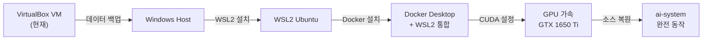

WSL2 전환 전체 가이드입니다!

---

## 전체 전환 흐름



---

## STEP 1: 현재 VM에서 데이터 백업

```bash
# VM 안에서 실행

# 1. 소스코드 백업
tar -czf /vagrant/ai-system-backup.tar.gz \
  --exclude='/ai-system/airflow/logs' \
  --exclude='__pycache__' \
  --exclude='*.pyc' \
  /ai-system

# 2. Docker 이미지 저장 (용량 큼 - 선택사항)
docker save \
  ai-system/airflow:2.9.0 \
  ai-system-rag-server \
  ai-system-gateway \
  | gzip > /vagrant/ai-system-images.tar.gz

# 3. Milvus 데이터 백업 (선택사항)
docker exec ai-system-milvus-1 \
  milvus-backup create --name ai-backup

# 백업 파일 확인
ls -lh /vagrant/ai-system-backup.tar.gz
```

> `/vagrant/` 폴더는 Windows 공유 폴더 → Windows에서 바로 접근 가능

---

## STEP 2: WSL2 설치 (Windows PowerShell 관리자)

```powershell
# 1. WSL2 활성화
wsl --install

# 재부팅 후

# 2. Ubuntu 22.04 설치
wsl --install -d Ubuntu-22.04

# 3. WSL2 버전 확인
wsl --list --verbose
# NAME            STATE    VERSION
# Ubuntu-22.04    Running  2      ← 반드시 VERSION 2

# 4. 기본 버전 WSL2로 설정
wsl --set-default-version 2
```

---

## STEP 3: Docker Desktop 설치

1. https://www.docker.com/products/docker-desktop 다운로드
2. 설치 시 **Use WSL2 instead of Hyper-V** 체크 ✅
3. 설치 후 Settings 확인:
   - **General** → Use WSL2 based engine ✅
   - **Resources → WSL Integration** → Ubuntu-22.04 ✅

```powershell
# 설치 확인
docker --version
docker compose version
```

---

## STEP 4: NVIDIA CUDA 드라이버 설치

### Windows 호스트에서
```powershell
# NVIDIA 드라이버 최신 버전 설치
# https://www.nvidia.com/Download/index.aspx
# GTX 1650 Ti → Game Ready Driver 최신버전

# 설치 후 확인
nvidia-smi
# +-----------------------------------------------------------------------------+
# | NVIDIA-SMI 5xx.xx    Driver Version: 5xx.xx    CUDA Version: 12.x          |
# | GTX 1650 Ti    ...   4096MiB                                                |
```

### WSL2 안에서 (Ubuntu)
```bash
# WSL2는 Windows 드라이버를 그대로 사용 — 별도 설치 불필요!
nvidia-smi  # Windows와 동일한 결과 나와야 함

# CUDA toolkit (컨테이너용)
# 별도 설치 불필요 — Docker 이미지에 포함됨
```

---

## STEP 5: NVIDIA Container Toolkit 설치

```bash
# WSL2 Ubuntu 안에서 실행

# 저장소 추가
curl -fsSL https://nvidia.github.io/libnvidia-container/gpgkey \
  | sudo gpg --dearmor -o /usr/share/keyrings/nvidia-container-toolkit-keyring.gpg

curl -s -L https://nvidia.github.io/libnvidia-container/stable/deb/nvidia-container-toolkit.list \
  | sed 's#deb https://#deb [signed-by=/usr/share/keyrings/nvidia-container-toolkit-keyring.gpg] https://#g' \
  | sudo tee /etc/apt/sources.list.d/nvidia-container-toolkit.list

# 설치
sudo apt update
sudo apt install -y nvidia-container-toolkit

# Docker에 NVIDIA 런타임 설정
sudo nvidia-ctk runtime configure --runtime=docker
sudo systemctl restart docker

# 확인
docker run --rm --gpus all nvidia/cuda:12.0-base-ubuntu22.04 nvidia-smi
# GTX 1650 Ti 정보 나오면 성공!
```

---

## STEP 6: 소스코드 복원

```bash
# WSL2 Ubuntu 안에서

# 작업 디렉토리 생성
sudo mkdir -p /ai-system
sudo chown $USER:$USER /ai-system

# Windows 공유 폴더에서 복원
# Windows D:\Development → WSL2에서 /mnt/d/Development
tar -xzf /mnt/c/Users/YOUR_USERNAME/ai-system-backup.tar.gz -C /

# 또는 GitHub에서 클론
git clone https://github.com/YOUR_USERNAME/ai-system.git /ai-system

# 모델 파일 복사
sudo mkdir -p /opt/models
cp -r /mnt/c/Users/YOUR_USERNAME/models/bge-m3 /opt/models/
```

---

## STEP 7: docker-compose.yml GPU 설정 추가

```bash
vi /ai-system/docker-compose.yml
```

```yaml
# Ollama GPU 설정
ollama:
  image: ollama/ollama:latest
  ports:
    - "11434:11434"
  deploy:
    resources:
      reservations:
        devices:
          - driver: nvidia
            count: 1
            capabilities: [gpu]    # ← GPU 사용
  mem_limit: 4g                    # GPU 사용하므로 RAM 줄임
  environment:
    - OLLAMA_NUM_PARALLEL=2
    - NVIDIA_VISIBLE_DEVICES=all   # ← 추가
  volumes:
    - ollama_data:/root/.ollama
    - /opt/models:/opt/models:ro
  networks: [ai-net]
  restart: unless-stopped

# RAG Server GPU 설정
rag-server:
  build:
    context: /ai-system/rag_server
    dockerfile: Dockerfile
  deploy:
    resources:
      reservations:
        devices:
          - driver: nvidia
            count: 1
            capabilities: [gpu]    # ← GPU 사용
  environment:
    - OLLAMA_URL=http://ollama:11434
    - MILVUS_HOST=milvus
    - REDIS_HOST=redis
    - REDIS_PASSWORD=changeme
    - PG_HOST=postgres
    - PG_PASSWORD=changeme
    - NVIDIA_VISIBLE_DEVICES=all   # ← 추가
  mem_limit: 4g                    # GPU로 모델 올라가므로 RAM 줄임
  ...
```

---

## STEP 8: RAG Server Dockerfile GPU 버전으로 수정

```dockerfile
# /ai-system/rag_server/Dockerfile
# CPU 버전
# FROM python:3.11-slim

# GPU 버전으로 변경
FROM nvidia/cuda:12.1-cudnn8-runtime-ubuntu22.04

RUN apt-get update && apt-get install -y \
    python3.11 python3-pip \
    && rm -rf /var/lib/apt/lists/*

WORKDIR /app
COPY requirements.txt .
RUN pip install --no-cache-dir -r requirements.txt

# GPU 버전 torch 설치
RUN pip install torch --extra-index-url \
    https://download.pytorch.org/whl/cu121

COPY . .
CMD ["uvicorn", "main:app", "--host", "0.0.0.0", "--port", "8080"]
```

---

## STEP 9: embedder.py GPU 설정

```python
# /ai-system/rag_server/embedder.py 수정
import torch

MODEL_NAME = "/opt/models/bge-m3/..."
EMBED_DIM  = 1024

# GPU 자동 감지
DEVICE = "cuda" if torch.cuda.is_available() else "cpu"
print(f"임베딩 디바이스: {DEVICE}")  # cuda 나와야 함

def get_model():
    global _model
    if _model is None:
        _model = SentenceTransformer(MODEL_NAME, device=DEVICE)
    return _model
```

---

## STEP 10: 실행 및 확인

```bash
cd /ai-system

# 빌드
docker compose build

# 실행
docker compose up -d

# GPU 사용 확인
docker exec ai-system-rag-server-1 python3 -c "
import torch
print('CUDA 사용 가능:', torch.cuda.is_available())
print('GPU:', torch.cuda.get_device_name(0))
print('VRAM:', torch.cuda.get_device_properties(0).total_memory // 1024**3, 'GB')
"
# CUDA 사용 가능: True
# GPU: NVIDIA GeForce GTX 1650 Ti
# VRAM: 4 GB
```

---

## WSL2 전환 후 성능 예상

| 항목 | VirtualBox (현재) | WSL2 + GPU |
|------|-----------------|-----------|
| BGE-M3 임베딩 | ~2~4 doc/분 | ~50+ doc/분 |
| EXAONE 추론 | ~5 tok/s | ~20~30 tok/s |
| RAG 응답 지연 | ~30~60초 | ~5~10초 |
| 메모리 효율 | VM 오버헤드 있음 | 네이티브 수준 |

GTX 1650 Ti VRAM 4GB면 EXAONE 7.8B 모델이 빠듯하게 들어갑니다. 양자화(Q4) 버전 사용 권장:

```bash
# Ollama에서 양자화 모델 사용
ollama pull exaone3.5:7.8b-instruct-q4_K_M
```

---

## 주의사항

```
⚠️  VirtualBox와 WSL2/Hyper-V는 동시 사용 불가
    → VirtualBox 완전히 종료 후 WSL2 사용
    → Windows 기능에서 Hyper-V 활성화 시 VirtualBox 성능 저하

⚠️  GTX 1650 Ti VRAM 4GB
    → BGE-M3 (2GB) + EXAONE Q4 (4GB) = 6GB 필요
    → 동시 로드 불가 → 순차 처리 또는 BGE-M3 CPU 모드 유지 권장

⚠️  WSL2 경로
    → Windows: C:\Users\... → WSL2: /mnt/c/Users/...
    → 파일 I/O는 WSL2 네이티브 경로(/home/...) 사용 권장
```

