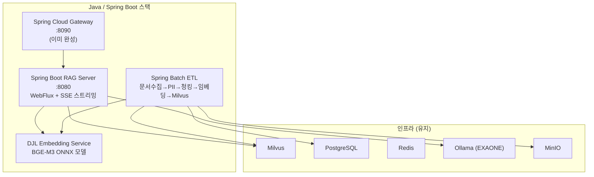

기술적으로 가능합니다! 다만 트레이드오프가 있어요.

---

## 결론 먼저

| 컴포넌트 | Python | Java/Spring | 난이도 |
|---------|--------|-------------|--------|
| RAG Server | FastAPI ✅ | Spring Boot ✅ | 중 |
| Gateway | Spring Cloud Gateway ✅ | 이미 Java ✅ | 완료 |
| ETL Pipeline | Airflow ✅ | Spring Batch ✅ | 중 |
| BGE-M3 임베딩 | sentence-transformers ✅ | DJL (Deep Java Library) ⚠️ | **고** |
| PII 마스킹 | presidio/regex ✅ | 정규식 직접 구현 ✅ | 하 |
| Milvus 연동 | pymilvus ✅ | milvus-sdk-java ✅ | 하 |
| Ollama 연동 | httpx ✅ | Spring WebClient ✅ | 하 |

---

## 전체 Java 스택 구성



---

## 핵심 난관: 임베딩 모델

Python의 `sentence-transformers`를 Java로 대체하는 방법이 3가지입니다:

### 방법 1: DJL (Deep Java Library) — 추천 ⭐
```xml
<dependency>
    <groupId>ai.djl</groupId>
    <artifactId>api</artifactId>
    <version>0.26.0</version>
</dependency>
<dependency>
    <groupId>ai.djl.huggingface</groupId>
    <artifactId>tokenizers</artifactId>
    <version>0.26.0</version>
</dependency>
<dependency>
    <groupId>ai.djl.onnxruntime</groupId>
    <artifactId>onnxruntime-engine</artifactId>
    <version>0.26.0</version>
</dependency>
```

```java
// BGE-M3 ONNX 모델로 임베딩
@Service
public class EmbeddingService {
    
    private final Predictor<String[], float[][]> predictor;
    
    public EmbeddingService() throws Exception {
        Criteria<String[], float[][]> criteria = Criteria.builder()
            .setTypes(String[].class, float[][].class)
            .optModelPath(Paths.get("/opt/models/bge-m3-onnx"))
            .optTranslator(new BgeTranslator())
            .build();
        this.predictor = criteria.loadModel().newPredictor();
    }
    
    public float[] embed(String text) throws Exception {
        return predictor.predict(new String[]{text})[0];
    }
}
```

### 방법 2: Python 임베딩 서버 분리 (현실적)
```
Java 앱 → HTTP → Python FastAPI (임베딩만 담당)
```
임베딩만 Python 마이크로서비스로 유지하고 나머지는 Java로 전환. 가장 현실적입니다.

### 방법 3: Ollama로 임베딩 통합
```java
// Ollama API로 임베딩 (BGE-M3를 Ollama에 등록)
WebClient.create("http://ollama:11434")
    .post().uri("/api/embeddings")
    .bodyValue(Map.of("model", "bge-m3", "prompt", text))
    .retrieve()
    .bodyToMono(Map.class);
```

---

## Java RAG Server 핵심 코드

### RAG Query 엔드포인트 (SSE 스트리밍)

```java
@RestController
@RequiredArgsConstructor
public class RagController {

    private final EmbeddingService embeddingService;
    private final MilvusService milvusService;
    private final OllamaService ollamaService;
    private final RerankerService rerankerService;
    private final SessionService sessionService;

    @PostMapping(value = "/rag/query",
                 produces = MediaType.TEXT_EVENT_STREAM_VALUE)
    public Flux<String> ragQuery(@RequestBody RagRequest request) {
        
        return Mono.fromCallable(() -> {
            // 1. PII 마스킹
            String cleanQuery = PiiScrubber.scrub(request.getQuery());
            
            // 2. 임베딩
            float[] queryVec = embeddingService.embed(cleanQuery);
            
            // 3. Dense 검색
            List<SearchResult> denseResults = 
                milvusService.search(queryVec, 15);
            
            // 4. HyDE 검색
            String hydeAnswer = ollamaService.generate(cleanQuery);
            float[] hydeVec = embeddingService.embed(hydeAnswer);
            List<SearchResult> hydeResults = 
                milvusService.search(hydeVec, 10);
            
            // 5. 중복 제거 + Reranking
            List<SearchResult> merged = merge(denseResults, hydeResults);
            List<SearchResult> topChunks = 
                rerankerService.rerank(cleanQuery, merged, 5);
            
            // 6. 컨텍스트 구성
            String context = topChunks.stream()
                .map(SearchResult::getContent)
                .collect(Collectors.joining("\n\n"));
            
            // 7. 세션 이력
            List<Message> history = sessionService.getHistory(
                request.getSessionId());
            
            return buildMessages(context, history, cleanQuery);
        })
        .flatMapMany(messages -> 
            // 8. EXAONE 스트리밍
            ollamaService.streamChat(messages)
        )
        .doOnComplete(() -> 
            sessionService.saveHistory(request.getSessionId(), 
                request.getQuery())
        );
    }
}
```

### Milvus 서비스

```java
@Service
public class MilvusService {

    private final MilvusServiceClient milvusClient;

    public MilvusService() {
        this.milvusClient = new MilvusServiceClient(
            ConnectParam.newBuilder()
                .withHost("milvus")
                .withPort(19530)
                .build()
        );
    }

    public List<SearchResult> search(float[] vector, int topK) {
        SearchParam param = SearchParam.newBuilder()
            .withCollectionName("knowledge_base")
            .withVectorFieldName("vector")
            .withVectors(List.of(toList(vector)))
            .withTopK(topK)
            .withMetricType(MetricType.COSINE)
            .withOutFields(List.of("content", "source"))
            .build();
        
        R<SearchResults> response = milvusClient.search(param);
        return parseResults(response.getData());
    }
}
```

### Spring Batch ETL

```java
@Configuration
@RequiredArgsConstructor
public class EtlJobConfig {

    @Bean
    public Job etlJob(JobBuilderFactory jobs, Step collectStep,
                      Step piiStep, Step chunkStep, Step embedStep) {
        return jobs.get("etlJob")
            .start(collectStep)
            .next(piiStep)
            .next(chunkStep)
            .next(embedStep)
            .build();
    }

    @Bean
    public Step collectStep(StepBuilderFactory steps) {
        return steps.get("collectStep")
            .<File, Document>chunk(10)
            .reader(fileItemReader())      // PDF/DOCX/TXT 읽기
            .processor(textExtractor())    // Apache Tika로 텍스트 추출
            .writer(minioWriter())         // MinIO 저장
            .build();
    }

    @Bean
    public Step embedStep(StepBuilderFactory steps) {
        return steps.get("embedStep")
            .<Chunk, VectorData>chunk(100)
            .reader(minioChunkReader())
            .processor(embeddingProcessor()) // DJL 임베딩
            .writer(milvusWriter())          // Milvus 적재
            .build();
    }
}
```

---

## 추가로 필요한 Java 라이브러리

```xml
<!-- 문서 파싱 (Python의 pdfminer, python-docx 대체) -->
<dependency>
    <groupId>org.apache.tika</groupId>
    <artifactId>tika-parsers-standard-package</artifactId>
    <version>2.9.1</version>
</dependency>

<!-- Milvus -->
<dependency>
    <groupId>io.milvus</groupId>
    <artifactId>milvus-sdk-java</artifactId>
    <version>2.4.1</version>
</dependency>

<!-- MinIO -->
<dependency>
    <groupId>io.minio</groupId>
    <artifactId>minio</artifactId>
    <version>8.5.7</version>
</dependency>

<!-- Redis (세션) -->
<dependency>
    <groupId>org.springframework.boot</groupId>
    <artifactId>spring-boot-starter-data-redis-reactive</artifactId>
</dependency>

<!-- DJL 임베딩 -->
<dependency>
    <groupId>ai.djl</groupId>
    <artifactId>api</artifactId>
    <version>0.26.0</version>
</dependency>

<!-- Spring Batch (ETL) -->
<dependency>
    <groupId>org.springframework.boot</groupId>
    <artifactId>spring-boot-starter-batch</artifactId>
</dependency>
```

---

## 현실적인 전환 권고

| 단계 | 작업 | 기간 |
|------|------|------|
| 1 | Gateway — 이미 완성 ✅ | 완료 |
| 2 | RAG Server → Spring Boot WebFlux | 2~3주 |
| 3 | ETL → Spring Batch | 2~3주 |
| 4 | 임베딩 → DJL ONNX 또는 분리 서비스 | 1~2주 |
| 5 | Airflow → Spring Scheduler/Quartz | 1주 |

**총 약 6~9주** 예상

---

## 개인적 추천

완전 Java 전환보다 **하이브리드** 방식이 현실적입니다:

```
Spring Boot (Gateway + RAG API + ETL 오케스트레이션)
    +
Python 마이크로서비스 (임베딩만 담당 — BGE-M3)
```

임베딩 모델을 Java로 돌리는 게 Python 대비 성능/안정성이 아직 부족해서 이 부분만 Python으로 두는 게 훨씬 실용적입니다.