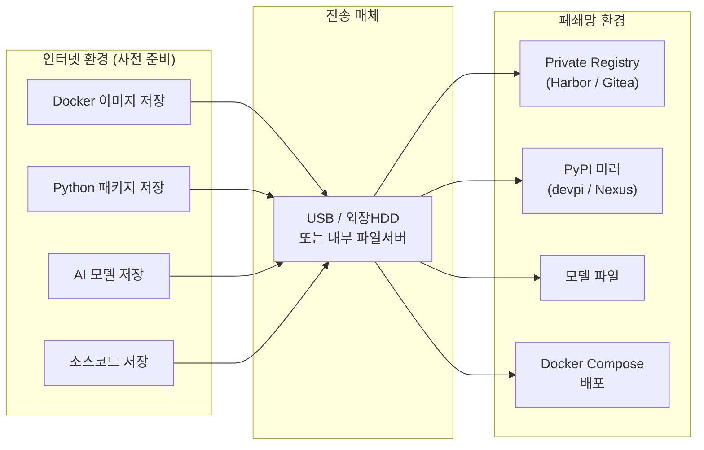

폐쇄망 설치는 크게 3가지를 사전에 준비해야 합니다.

---

## 폐쇄망 설치 전략 전체 개요



---

## STEP 1: 인터넷 환경에서 사전 수집

### 1-1. Docker 이미지 전체 저장

```bash
# 인터넷 되는 PC에서 실행
# 모든 이미지 한번에 pull & save

IMAGES=(
  "apache/airflow:2.9.0-python3.11"
  "postgres:16-alpine"
  "redis:7.2-alpine"
  "minio/minio:RELEASE.2023-03-13T19-46-17Z"
  "milvusdb/milvus:v2.4.0"
  "quay.io/coreos/etcd:v3.5.5"
  "ollama/ollama:latest"
  "prom/prometheus:v2.50.1"
  "grafana/grafana:10.3.1"
)

for img in "${IMAGES[@]}"; do
  docker pull $img
done

# 하나의 tar로 묶어서 저장
docker save "${IMAGES[@]}" | gzip > ai-system-images.tar.gz

echo "완료: $(du -sh ai-system-images.tar.gz)"
```

### 1-2. Airflow 커스텀 이미지 빌드 후 저장

```bash
# ai-system 소스 폴더에서
cd /ai-system
docker build -t ai-system/airflow:2.9.0 .
docker save ai-system/airflow:2.9.0 | gzip > ai-system-airflow-custom.tar.gz
```

### 1-3. RAG Server / Gateway 이미지 저장

```bash
docker compose build rag-server gateway
docker save ai-system/rag-server:latest ai-system/gateway:latest \
  | gzip > ai-system-custom-apps.tar.gz
```

### 1-4. Python 패키지 저장

```bash
# requirements 파일 기반으로 패키지 다운로드
mkdir -p /offline/pip-packages

# RAG Server 패키지
pip download \
  -r /ai-system/rag_server/requirements.txt \
  --dest /offline/pip-packages \
  --platform linux_x86_64 \
  --python-version 3.11 \
  --only-binary=:all:

# Airflow ETL 패키지
pip download \
  pymilvus sentence-transformers psycopg2-binary \
  minio pdfminer.six python-docx beautifulsoup4 httpx \
  torch --extra-index-url https://download.pytorch.org/whl/cpu \
  --dest /offline/pip-packages \
  --platform linux_x86_64 \
  --python-version 3.11 \
  --only-binary=:all:

tar -czf pip-packages.tar.gz /offline/pip-packages
echo "패키지 크기: $(du -sh pip-packages.tar.gz)"
```

### 1-5. AI 모델 저장

```bash
# BGE-M3 모델 (HuggingFace)
pip install huggingface_hub
python3 -c "
from huggingface_hub import snapshot_download
snapshot_download(
    repo_id='BAAI/bge-m3',
    local_dir='/offline/models/bge-m3',
    ignore_patterns=['*.h5', '*.ot', '*.msgpack']
)
"

# BGE-Reranker
python3 -c "
from huggingface_hub import snapshot_download
snapshot_download(
    repo_id='BAAI/bge-reranker-v2-m3',
    local_dir='/offline/models/bge-reranker-v2-m3'
)
"

# EXAONE 모델 (Ollama)
ollama pull exaone3.5:7.8b
# Ollama 모델 저장 위치: ~/.ollama/models
tar -czf ollama-models.tar.gz ~/.ollama/models

tar -czf ai-models.tar.gz /offline/models
echo "모델 크기: $(du -sh ai-models.tar.gz ollama-models.tar.gz)"
```

### 1-6. 소스코드 저장

```bash
cd /ai-system
git archive --format=tar.gz \
  --output=/offline/ai-system-source.tar.gz HEAD

# 또는 전체 폴더
tar -czf ai-system-source.tar.gz \
  --exclude='.git' \
  --exclude='airflow/logs' \
  --exclude='__pycache__' \
  --exclude='*.pyc' \
  /ai-system
```

---

## STEP 2: 폐쇄망으로 전송

### 전송 파일 목록

| 파일 | 크기 (예상) | 내용 |
|------|-----------|------|
| `ai-system-images.tar.gz` | ~15GB | 공식 Docker 이미지 |
| `ai-system-airflow-custom.tar.gz` | ~3GB | 커스텀 Airflow |
| `ai-system-custom-apps.tar.gz` | ~2GB | RAG/Gateway |
| `pip-packages.tar.gz` | ~5GB | Python 패키지 |
| `ai-models.tar.gz` | ~3GB | BGE-M3, Reranker |
| `ollama-models.tar.gz` | ~5GB | EXAONE 모델 |
| `ai-system-source.tar.gz` | ~50MB | 소스코드 |

**총 약 33GB** → 외장 SSD 권장

---

## STEP 3: 폐쇄망에서 설치

### 3-1. Docker 이미지 로드

```bash
# 폐쇄망 서버에서
# 공식 이미지 로드
docker load < ai-system-images.tar.gz

# 커스텀 이미지 로드
docker load < ai-system-airflow-custom.tar.gz
docker load < ai-system-custom-apps.tar.gz

# 확인
docker images
```

### 3-2. 모델 파일 복사

```bash
# BGE-M3, Reranker 모델
tar -xzf ai-models.tar.gz -C /opt/
# → /opt/models/bge-m3/ 로 배치

# EXAONE (Ollama)
tar -xzf ollama-models.tar.gz -C ~/
# → ~/.ollama/models/ 로 배치
```

### 3-3. pip 패키지 로컬 미러 설정

```bash
# 패키지 압축 해제
tar -xzf pip-packages.tar.gz -C /offline/

# pip 설치 시 로컬 경로 사용
pip install \
  --no-index \
  --find-links /offline/pip-packages \
  pymilvus sentence-transformers psycopg2-binary minio \
  pdfminer.six python-docx beautifulsoup4 httpx torch
```

### 3-4. docker-compose.yml 수정

폐쇄망에서는 이미지 pull 없이 로컬 이미지를 사용하도록:

```yaml
# docker-compose.yml 수정
# 모든 서비스에 pull_policy: never 추가

services:
  ollama:
    image: ollama/ollama:latest
    pull_policy: never          # ← 추가
    ...

  milvus:
    image: milvusdb/milvus:v2.4.0
    pull_policy: never          # ← 추가
    ...

  rag-server:
    image: ai-system/rag-server:latest
    pull_policy: never          # ← 추가
    # build 섹션 주석 처리 (빌드 불필요)
    ...
```

### 3-5. Airflow Dockerfile 수정

```dockerfile
FROM ai-system/airflow:2.9.0  # ← 로컬 이미지 사용

# pip를 로컬 패키지로 설치
COPY /offline/pip-packages /pip-packages

RUN pip install \
  --no-index \
  --find-links /pip-packages \
  pymilvus sentence-transformers psycopg2-binary \
  minio pdfminer.six python-docx beautifulsoup4 httpx torch
```

### 3-6. 실행

```bash
cd /ai-system

# 소스코드 압축 해제
tar -xzf ai-system-source.tar.gz -C /ai-system

# 실행 (이미지 pull 없이)
docker compose up -d

# 초기화
python init_milvus.py
docker exec -i ai-system-postgres-1 \
  psql -U postgres -d ai_system < init_postgres.sql

# Airflow 초기화
docker compose run --rm airflow-init

# 확인
docker compose ps
```

---

## STEP 4: 내부 레지스트리 구축 (선택)

여러 서버에 반복 배포한다면 내부 Docker Registry 구축 권장:

```bash
# 내부 레지스트리 서버에서
docker run -d \
  -p 5000:5000 \
  --restart always \
  --name registry \
  -v /opt/registry:/var/lib/registry \
  registry:2

# 이미지 태깅 후 push
docker tag ollama/ollama:latest localhost:5000/ollama/ollama:latest
docker push localhost:5000/ollama/ollama:latest

# 배포 대상 서버에서 pull
docker pull 내부레지스트리IP:5000/ollama/ollama:latest
```

---

## 체크리스트

```bash
# 폐쇄망 설치 전 확인
□ Docker 이미지 전체 로드 완료
□ /opt/models/bge-m3/ 모델 존재
□ ~/.ollama/models/ EXAONE 존재
□ docker-compose.yml pull_policy: never 적용
□ docker compose ps — 전체 Up
□ curl http://localhost:8080/health → ok
□ Airflow UI http://localhost:8081 접속 확인
□ ETL DAG 수동 실행 성공
□ RAG 쿼리 응답 확인
```

가장 시간 걸리는 건 **모델 파일(~8GB)** 과 **Docker 이미지(~20GB)** 전송입니다. 외장 SSD 준비하시면 됩니다! 😊