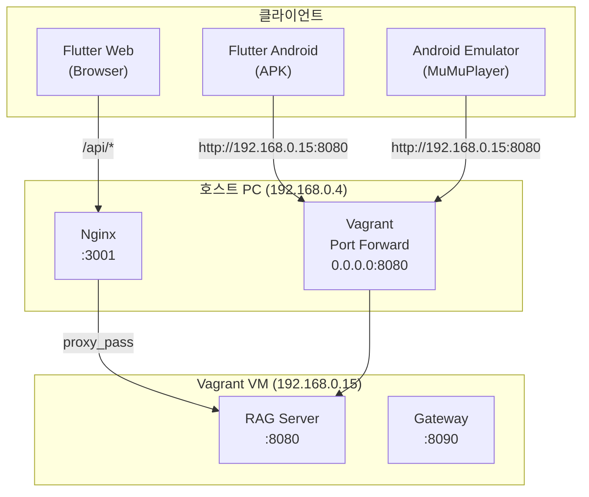
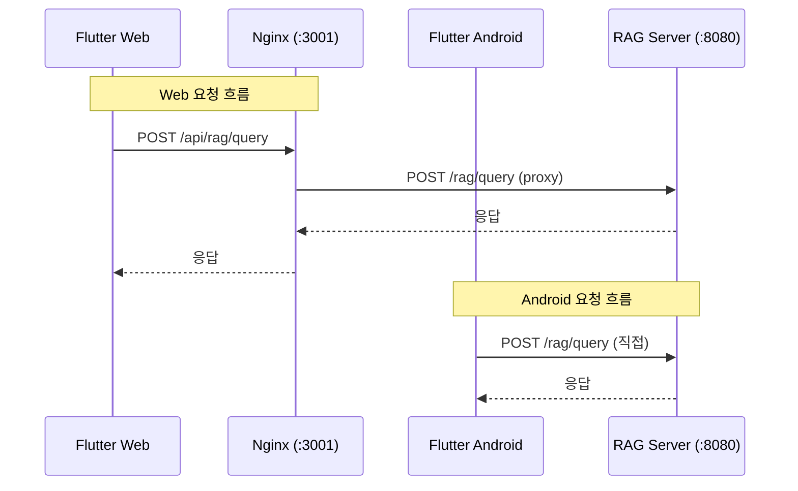
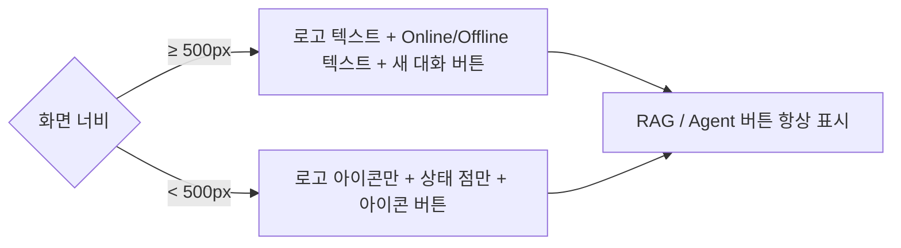
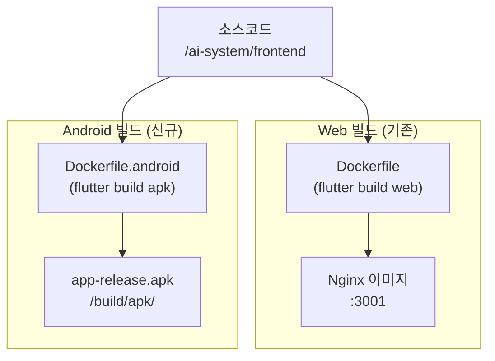
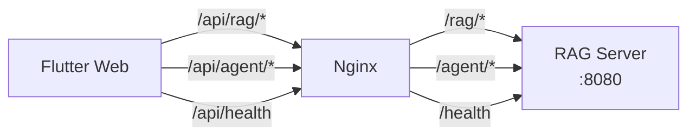
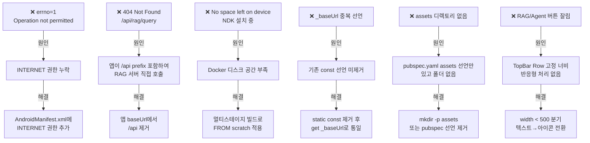

# Flutter Android 배포 개발 산출물

- **프로젝트**: AI RAG System Frontend
- **문서 유형**: Android 배포 전환 개발 산출물
- **작성일**: 2026-03-16
- **버전**: 1.0.0

---

## 1. 개요

본 문서는 Flutter Web으로 개발된 AI RAG System Frontend를 Android 앱으로 배포하기 위한 전환 작업의 개발 산출물입니다. 기존 Web 빌드 환경(Docker + Nginx)을 유지하면서 Android APK 빌드 파이프라인을 추가하였습니다.

---

## 2. 시스템 아키텍처

### 2.1 전체 네트워크 구조



### 2.2 Web vs Android API 요청 흐름



---

## 3. 변경 파일 목록

### 3.1 신규 추가 파일

| 파일                              | 설명                         |
| ------------------------------- | -------------------------- |
| `Dockerfile.android`            | Android APK 빌드용 Docker 이미지 |
| `android/app/src/main/res/xml/` | (선택) 네트워크 보안 설정            |

### 3.2 수정 파일

| 파일                                         | 변경 내용                    |
| ------------------------------------------ | ------------------------ |
| `docker-compose.yml`                       | android-builder 서비스 추가   |
| `lib/services/api_service.dart`            | Web/앱 분기 API URL 처리      |
| `lib/widgets/top_bar.dart`                 | 모바일 반응형 UI 개선            |
| `android/app/src/main/AndroidManifest.xml` | INTERNET 권한 및 HTTP 허용 추가 |
| `pubspec.yaml`                             | assets 디렉토리 설정 수정        |

---

## 4. 상세 변경 내용

### 4.1 API URL 분기 처리

**파일**: `lib/services/api_service.dart`

Web은 Nginx를 통해 `/api` 상대경로를 사용하고, Android 앱은 RAG 서버에 직접 접속하므로 절대경로가 필요합니다. Nginx가 `/api` prefix를 제거하고 전달하기 때문에 앱에서는 `/api` 없이 요청해야 합니다.

```dart
import 'package:flutter/foundation.dart';

class ApiService {
  // 기존 static const String _baseUrl = '/api'; 제거

  static String get _baseUrl {
    if (kIsWeb) return '/api';
    const url = String.fromEnvironment(
      'API_URL',
      defaultValue: 'http://192.168.0.15:8080',
    );
    return url;
  }
}
```

### 4.2 AndroidManifest.xml 권한 설정

**파일**: `android/app/src/main/AndroidManifest.xml`

```xml
<manifest xmlns:android="http://schemas.android.com/apk/res/android">
    <!-- 인터넷 권한 (없으면 errno=1 Operation not permitted 오류) -->
    <uses-permission android:name="android.permission.INTERNET"/>

    <application
        android:label="ai_system_frontend"
        android:name="${applicationName}"
        android:icon="@mipmap/ic_launcher"
        android:usesCleartextTraffic="true">  <!-- HTTP 허용 -->
        ...
    </application>
</manifest>
```

### 4.3 docker-compose.yml Android 빌드 서비스 추가

```yaml
android-builder:
  build:
    context: /ai-system/frontend
    dockerfile: Dockerfile.android
  container_name: ai-system-android-builder
  volumes:
    - /ai-system/frontend/build/apk:/output
  profiles:
    - android   # 일반 up 시 실행 안 됨
  restart: "no"
```

### 4.4 Dockerfile.android

멀티스테이지 빌드로 APK만 추출하여 디스크 사용량을 최소화합니다.

```dockerfile
FROM ghcr.io/cirruslabs/flutter:stable AS builder

WORKDIR /app
RUN mkdir -p /output
COPY . .

ARG API_URL=http://192.168.0.15:8080
ENV API_URL=$API_URL

RUN flutter pub get
RUN yes | flutter doctor --android-licenses || true
RUN flutter build apk --release \
    --dart-define=API_URL=$API_URL

# APK만 추출 (이미지 크기 최소화)
FROM scratch
COPY --from=builder /app/build/app/outputs/flutter-apk/app-release.apk /ai-system.apk
```

### 4.5 TopBar 반응형 UI 개선

모바일 좁은 화면(width < 500px)에서 RAG/Agent 버튼이 잘리는 문제를 해결합니다.



---

## 5. 빌드 파이프라인

### 5.1 빌드 흐름



### 5.2 빌드 명령어

**Web 배포 (기존 동일)**

```bash
docker-compose up -d frontend
```

**Android APK 빌드**

```bash
# 출력 디렉토리 생성 (최초 1회)
mkdir -p /ai-system/frontend/build/apk

# APK 빌드
docker-compose --profile android run --rm android-builder

# 결과물 확인
ls -lh /ai-system/frontend/build/apk/ai-system.apk
```

**서버 IP가 변경된 경우**

```bash
docker-compose --profile android run --rm \
  -e API_URL=http://변경된IP:8080 \
  android-builder
```

---

## 6. 환경별 접속 정보

### 6.1 API URL 환경별 설정

| 실행 환경                   | API_URL                    | 비고            |
| ----------------------- | -------------------------- | ------------- |
| Flutter Web             | `/api`                     | Nginx 프록시 경유  |
| Android 실기기 (동일 WiFi)   | `http://192.168.0.15:8080` | Vagrant VM 직접 |
| Android Studio 에뮬레이터    | `http://10.0.2.2:8080`     | 호스트 루프백 특수 IP |
| MuMuPlayer / BlueStacks | `http://192.168.0.15:8080` | LAN 직접 접근 가능  |

### 6.2 Nginx 프록시 라우팅 (Web 전용)



> Gateway(:8090)는 현재 Nginx 라우팅에서 사용하지 않음

---

## 7. 트러블슈팅

### 7.1 발생 이슈 및 해결 내역



---

## 8. 의존성 패키지 호환성

모든 패키지가 Flutter 멀티플랫폼을 지원하며 Android 빌드에 문제 없음을 확인하였습니다.

| 패키지                | 버전      | Web | Android | iOS |
| ------------------ | ------- | --- | ------- | --- |
| flutter_markdown   | ^0.6.18 | ✅   | ✅       | ✅   |
| http               | ^1.1.0  | ✅   | ✅       | ✅   |
| provider           | ^6.1.1  | ✅   | ✅       | ✅   |
| shared_preferences | ^2.2.2  | ✅   | ✅       | ✅   |
| uuid               | ^4.3.3  | ✅   | ✅       | ✅   |
| intl               | ^0.19.0 | ✅   | ✅       | ✅   |
| google_fonts       | ^6.1.0  | ✅   | ✅       | ✅   |
| animated_text_kit  | ^4.2.2  | ✅   | ✅       | ✅   |
| shimmer            | ^3.0.0  | ✅   | ✅       | ✅   |
| flutter_animate    | ^4.5.0  | ✅   | ✅       | ✅   |

---

## 9. 향후 과제

| 항목                     | 우선순위 | 설명                                       |
| ---------------------- | ---- | ---------------------------------------- |
| HTTPS 전환               | 높음   | HTTP cleartext 의존성 제거, 실기기 배포 시 필수       |
| iOS 빌드 환경 구성           | 중간   | macOS + Xcode + Apple Developer 계정 필요    |
| Play Store 서명 설정       | 낮음   | 외부 배포 시 keystore 생성 및 build.gradle 서명 설정 |
| 환경별 config 분리          | 중간   | dev/staging/prod API URL 관리 체계화          |
| BottomNavigationBar 추가 | 낮음   | 모바일 UX 개선 (현재 사이드 네비 레일 사용)              |
